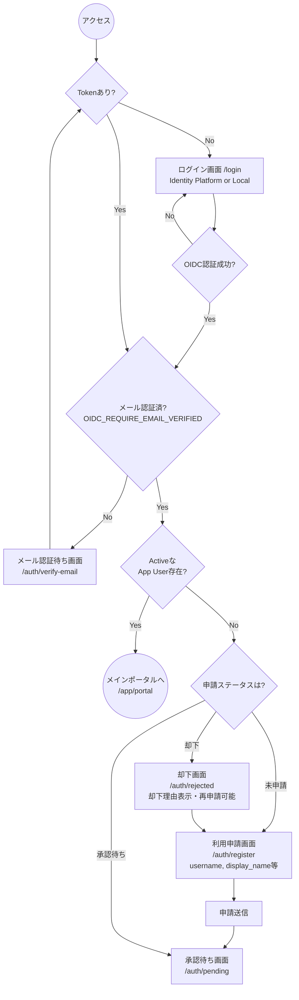

# フロントエンドデザイン仕様・実装計画

本計画は `initial_specification.md` および `pre_implementation_plan.md` に基づき、本アプリケーション単体で先行して実装・検証可能なフロントエンドの設計仕様と画面フローを定義するものです。

---

## 1. 認証・オンボーディングフロー (Auth & Registration Flow)

`AUTH_MODE`, `RBAC_MODE`, および OIDC の要件に基づく、未登録ユーザーからアプリ利用開始までの画面遷移フローです。

**Local Fallback認証について:**
ローカルテスト用の手動トークン入力フォームは、開発環境起動時（例: `import.meta.env.DEV` が true の場合）のみ、ログイン画面にトグルボタン等で表示されるように制限します。



## 2. ロール定義とルーティング設計 (Routing Structure)

まず前提として、`Operator / Inventory / Procurement / Admin` は主に **画面を整理するためのアプリ区分** です。ユーザー権限そのものとは分けて扱い、各ユーザーは必要に応じて複数のアプリ区分へアクセスできます。

権限制御は別途ロールで定義し、各ユーザーのロールに基づいてアクセス可否とサイドバー項目を動的に出し分けます。

* **Admin** (管理者)
* **Operator** (部品割当・不足確認・購買申請を主に行う)
* **Auditor** (監査)
* **Acceptance Inspector** (商品の到着確認・検収のみを行う独立ロール)

`Acceptance Inspector` は文書上の表示名として使い、実装上の role key は `receiving_inspector` に統一します。

### ルーティング階層

* **`/`** : ベースルート。未認証なら `/login`、認証済なら `/app/portal` へリダイレクト。
* **`/auth/*`** : 認証系画面（Layoutなし）
  * `/auth/login` : ログイン画面
  * `/auth/verify-email` : メールアドレス確認要求画面
  * `/auth/register` : アカウント本登録画面
  * `/auth/pending` : 管理者承認待ち画面
  * `/auth/rejected` : 承認却下表示・再申請画面
* **`/app/*`** : アプリケーション画面（共通Layout: Header, Sidebar 構成）
  * **`/app/portal`** : 全ユーザー共通のポータル（ダッシュボード）。各機能への導線やサマリを表示。
  * **Operator 向け機能**
    * `/app/operator/requirements` : 要求一覧・作成
    * `/app/operator/reservations` : 予約状況管理
    * `/app/operator/shortage` : 不足品確認、既存購買状況確認、CSV 出力
    * `/app/operator/imports/upload` : import アップロード
    * `/app/operator/imports/history` : import 履歴
  * **Inventory (在庫管理) 向け機能**
    * `/app/inventory/items` : アイテム別在庫状況
    * `/app/inventory/locations` : ロケーション別在庫状況
    * `/app/inventory/events` : 入庫(Receive)・移動(Move)・調整(Adjust) 実行・履歴
  * **Procurement (購買管理) 向け機能**
    * `/app/procurement/requests` : 購買リクエスト一覧
    * `/app/procurement/requests/[id]` : 購買リクエスト詳細
    * `/app/procurement/ocr-queue` : 見積書アップロード・OCR結果編集
    * `/app/procurement/drafts/[id]` : 購買申請の明細区分（予算・物品区分）入力画面
  * **Inspector (検収) 向け機能**
    * `/app/inspector/arrivals` : 商品の到着確認・検収（Receive）画面
  * **Admin 向け機能**
    * `/app/admin/users` : ユーザー管理（利用申請の承認/却下含む）
    * `/app/admin/roles` : ロール・権限管理
    * `/app/admin/master` : マスタ管理

## 3. 主要画面（UI）の設計方針

全体的なデザインのトーン＆マナーは **「クリーンでモダン」** とし、`shadcn/ui` をベースに余白を活かしたUIとします。

* **レイアウト構成**: 
  * 左側にナビゲーション（Sidebar）、上部にユーザープロファイルや現在位置を示すパンくずリスト（Header）。
* **Global Context Bar**:
  * `Device / Scope` は常時必須ではない。
  * 部品管理、部品割当、不足確認、申請区分など文脈依存の強い画面では Context Bar を表示し、Portal / Admin / Auth では非表示または簡略表示を許可する。
  * URL クエリまたはパスパラメータで文脈復元できる形にする。
* **共通ポータル画面 (`/app/portal`)**:
  * ユーザーのロールに応じたウィジェットや通知（例: 「承認待ちの申請があります」「検収待ちの荷物があります」）を表示。
* **不足品確認画面 (Operator > Shortage)**:
  * shortage は直接 request を一括起票する画面ではなく、`Required / Reserved / Available / In Request Flow / Ordered / Received / Actionable Shortage` を並べて判断する画面とする。
  * 選択中の scope の不足部品一覧を CSV 出力できることを優先する。
  * 既存の procurement request がある場合は該当行から参照できる導線を置く。
* **OCR キューと購買申請作成画面 (Procurement)**:
  * **Step 1 (OCR プレビュー)**: 画面を左右に分割（Split Pane）。左側にアップロードされたPDF/画像のプレビュー、右側にGeminiが抽出したデータフォーム。
    * quotation 単位で少なくとも `supplier / quotation number / issue date` を扱う。
    * row 単位で少なくとも `manufacturer / item number / description / quantity / leadtime` を扱う。
    * `leadtime` は日付ではなく、発注日から到着予定日までの duration として編集・確認できる UI にする。
  * **Step 2 (明細の区分設定 - Bulk Assignment UI)**: 
    * OCR確定後、購買申請提出前に各 order line に対する納品先、予算区分、会計区分（固定資産、消耗品など）を指定する画面に遷移。
    * 複数明細（order lines）がある場合の手間を省くため、**複数の行にチェックを入れて一括で区分を適用（Bulk Assign）** できるUIや、ドラッグ＆ドロップまたはプルダウンで素早く配分できる表形式のUIを実装する。
    * supplier が取引先 table に未登録の場合は、supplier contact の追加入力欄を表示する。
  * **Step 3 (マスタ照合と送信前確認)**:
    * item / supplier の既存マスタとの照合結果を明示する。
    * item 未登録時は submission をブロックし、その場で item 登録フローへ進ませる。
    * item 登録は誰でも実行可能で、追加承認は不要とする。
    * 購買申請が棄却された場合や不要になった場合は、登録した item を後から削除できる運用を許容する。
    * item 登録時は少なくとも `manufacturer / canonical item number / description / item category` を入力必須とする。
    * quotation 記載の品番が canonical item number と異なる場合は alias を追加できるようにする。
    * pack 品番のような alias は、たとえば `ER2` を canonical item とし、`ER2-P4` を supplier alias、`units_per_order = 4` として扱える UI にする。
  * submit 時は quotation PDF と structured payload を一緒に backend へ送る前提とする。
* **Item / Alias 事前登録導線**:
  * quotation registration とは別に、item と alias を CSV で一括登録できる導線を持たせる。
  * quotation review で必要になる項目と、CSV 事前登録の列定義はできるだけ整合させる。
  * item CSV は少なくとも `manufacturer / canonical item number / description / item category` を扱えるようにする。
  * alias CSV は少なくとも `supplier / ordered item number / canonical item / units_per_order` を扱えるようにする。
* **Project / Budget Category 選択UI**:
  * selector は外部 live call ではなく backend のローカル cache を参照する。
  * upstream 更新は webhook 起点で反映し、必要に応じて手動再同期導線を置く。
* **CSV I/O UI**:
  * shortage CSV export は固定列順で出力し、requirements/item/alias CSV import と概念的に揃える。
  * item CSV import と alias CSV import は preview, validation result, apply result を段階的に見せる。
  * import error は行番号、対象列、修正内容が分かる表示にする。
* **利用申請の承認フロー (Admin > Users)**:
  * 承認待ちのユーザーをタブで一覧表示し、「Approve」「Reject」のアクションを提供。
* **在庫調整画面 (Inventory > Events)**:
  * 入力ミスを防ぐための Undo 用のUI（直近の操作履歴と Undo ボタン）。
* **同期・再試行 UI (Procurement)**:
  * `Last synced at`、同期中、同期失敗、再同期、OCR 再試行を表示できる状態設計を入れる。
  * 詳細画面では `normalized status` と `raw external status` を区別表示する。

## 4. フロントエンド技術スタックとディレクトリ構造

* **Framework**: React + Vite (TypeScript)
* **Styling**: Tailwind CSS + shadcn/ui (Radix Primitives)
* **Routing**: React Router
* **Data Fetching**: SWR
* **Form Handling**: React Hook Form + Zod

**ディレクトリ構造案 (`frontend/src/`)**:
```text
src/
 ├─ assets/       # 画像等の静的リソース
 ├─ components/   # 全体共通のUIコンポーネント (shadcn UI等)
 ├─ features/     # ドメイン毎の機能カプセル化 (auth, portal, operator, inventory, procurement, inspector, admin)
 ├─ layouts/      # 共通レイアウト (MainLayout, AuthLayout)
 ├─ lib/          # utils系関数
 ├─ routes/       # React Router のルーティング定義
 ├─ stores/       # 全体的な状態管理 (Zustand等)
 └─ types/        # 共通のTypeScript型定義
```

## Verification Plan

### Manual Verification
1. **ルーティングと権限のモック確認**
   * モック用のJWT（Admin, Operator, Acceptance Inspector 等）を用いて、各画面へのアクセス可否を確認。
2. **オンボーディングフローのUI確認**
   * モックAPIを利用して、`Login -> 登録 -> 承認待ち -> 却下 -> 再申請` の画面遷移を確認。
   * ローカル環境フラグによる手動トークン入力フォームの表示・非表示確認。
3. **Device / Scope 文脈の条件表示確認**
   * Context Bar が必要画面にだけ表示されること、URL から文脈復元できることを確認する。
4. **不足 CSV 出力確認**
   * scope 切替、coverage rule 切替後に、`device / scope / manufacturer / item number / description / quantity` で不足一覧が CSV 出力されることを確認する。
5. **明細一括カテゴリ設定UIの確認**
   * モックの Order Lines を用意し、複数行の予算区分・物品区分が一括でスムーズに変更できるか確認する。
6. **同期・再試行導線の確認**
   * OCR 失敗、同期失敗、再同期、再申請時編集可の各状態が UI 上で識別できることを確認する。
7. **未登録 supplier / item の分岐確認**
   * supplier 未登録時に contact 入力が出ること、item 未登録時に submission がブロックされ item 登録フローへ進めることを確認する。
8. **item / alias 登録確認**
   * canonical item と supplier alias を個別または CSV で登録でき、pack 品番に `units_per_order` を持たせられることを確認する。
9. **project / budget category cache 更新確認**
   * webhook 反映後または手動再同期後に selector 候補が更新され、通常描画時は live call しないことを確認する。
