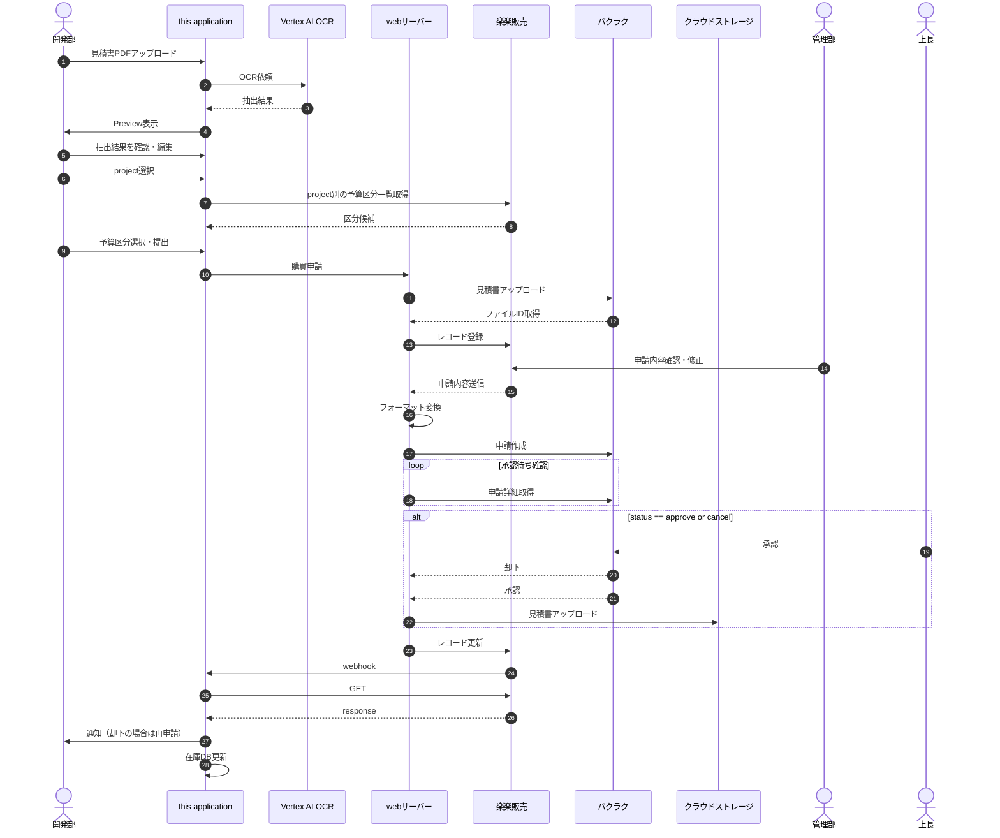
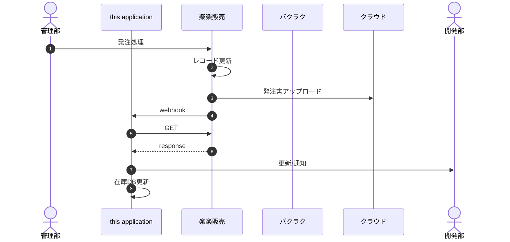
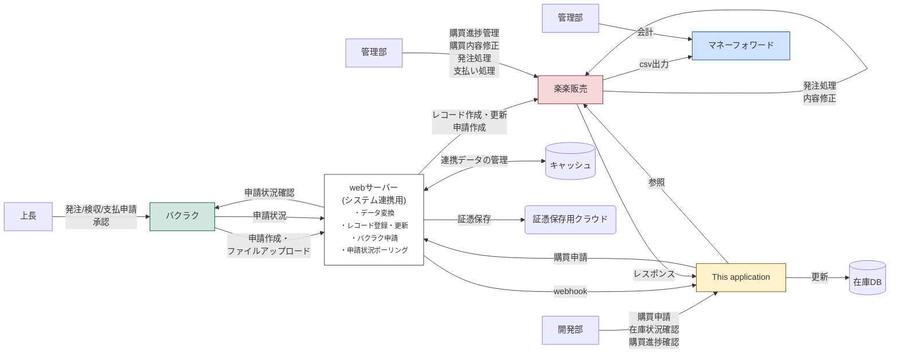

# **Inventory Management System**

# Requirement Precedence
When statements conflict, interpret in this order:
1. documents/specification.md
2. current code behavior

# Non-Functional Requirements

| Requirement | Specification |
|-------------|---------------|
| Target OS | Windows |
| Database | PostgreSQL 18+ (primary deployment target via Docker Compose) |
| Language (Backend) |Go 1.24+|
| Backend API | Go HTTP API (chi or gin; recommended: chi) |
| Backend DB Access | pgx / pgxpool + SQL-first queries (sqlc recommended, with handwritten SQL for complex searches)|
| Language (Frontend) | TypeScript |
| UI Framework | React (+React Router for SPA routing) |
| UI Styling | Tailwind CSS (+shadcn/ui or Radix primitives) |
| Data Fetching | SWR |
| Package Manager (Go) | Go Modules |
| Package Manager (Frontend) | npm |
| Frontend Builder | Vite |
| User Model | Shared-server operation on trusted internal network, with forward compatibility for fuller RBAC / permission-based deployment |
| Authentication/Authorization | Browser/API auth uses Authorization: Bearer <JWT>. The browser-facing cloud target uses Identity Platform email/password sign-in to obtain the Bearer token, while manual token entry remains a local/test fallback. When OIDC_REQUIRE_EMAIL_VERIFIED=1, users must complete email verification before the backend will accept their token. The frontend must therefore support account creation, verification-email send/resend, and an unverified-account holding page. Verified OIDC claims (email, sub, optional hd) then resolve either to an active app user or to a self-registration flow (username, required display_name, requested role, optional memo). If no active app user exists for a verified identity, the browser must route the user into registration and block normal app access until an admin approves the request. Admins review and approve/reject requests from the Users page; rejected requests must keep history and expose the rejection reason to the applicant. AUTH_MODE controls bearer-token enforcement (none, oidc_dry_run, oidc_enforced) and RBAC_MODE controls role enforcement (none, rbac_dry_run, rbac_enforced). Bootstrap exception: POST /api/users` may omit Bearer auth only when zero active users exist.|
| CSV Encoding | UTF-8 (no BOM) or CP932|

# Database structure

```mermaid
erDiagram

    MANUFACTURERS {
        int manufacturer_id PK
        string name UK
        string created_at
        string updated_at
    }

    SUPPLIERS {
        int supplier_id PK
        string name UK
        string created_at
        string updated_at
    }

    DEPARTMENTS {
        int department_id PK
        string department_code UK
        string department_name UK
        string created_at
        string updated_at
    }

    ITEM_CATEGORIES {
        int category_id PK
        string canonical_name UK
        string created_at
        string updated_at
    }

    CATEGORY_ALIASES {
        int category_alias_id PK
        string alias_category UK
        int category_id FK
        string created_at
        string updated_at
    }

    ITEMS {
        int item_id PK
        string item_number UK
        int manufacturer_id FK
        int category_id FK
        int primary_department_id FK
        string engineering_domain
        string url
        string description
        string lifecycle_status
        string created_at
        string updated_at
    }

    SUPPLIER_ITEM_ALIASES {
        int alias_id PK
        int supplier_id FK
        string ordered_item_number
        int canonical_item_id FK
        int units_per_order
        string created_at
        string updated_at
    }

    DEVICES {
        int device_id PK
        string device_code UK
        string device_name UK
        string device_type
        string status
        string planned_start_at
        string created_at
        string updated_at
    }

    DEVICE_SCOPES {
        int scope_id PK
        int device_id FK
        int parent_scope_id FK
        string scope_code UK
        string scope_name
        string scope_type
        int owner_department_id FK
        string status
        string planned_start_at
        string planned_end_at
        string created_at
        string updated_at
    }

    SCOPE_DEPARTMENTS {
        int scope_department_id PK
        int scope_id FK
        int department_id FK
        string involvement_type
        string created_at
    }

    LOCATIONS {
        int location_id PK
        string code UK
        string name
        string location_type
        bool is_active
        string created_at
        string updated_at
    }

    INVENTORY_BALANCES {
        int inventory_balance_id PK
        int item_id FK
        int location_id FK
        int on_hand_quantity
        int reserved_quantity
        int available_quantity
        string updated_at
    }

    INVENTORY_EVENTS {
        int inventory_event_id PK
        string event_type
        int item_id FK
        int from_location_id FK
        int to_location_id FK
        int quantity
        int actor_user_id FK
        string source_type
        int source_id
        string correlation_id
        int reversed_by_event_id FK
        string note
        string occurred_at
    }

    INVENTORY_EVENT_LINKS {
        int link_id PK
        int inventory_event_id FK
        string linked_entity_type
        int linked_entity_id
        string created_at
    }

    ASSEMBLIES {
        int assembly_id PK
        string assembly_code UK
        string name UK
        string description
        string created_at
        string updated_at
    }

    ASSEMBLY_COMPONENTS {
        int assembly_id PK
        int item_id PK
        int quantity
        string created_at
    }

    SCOPE_ASSEMBLY_REQUIREMENTS {
        int requirement_id PK
        int scope_id FK
        int assembly_id FK
        int quantity
        string note
        string created_at
        string updated_at
    }

    SCOPE_ITEM_REQUIREMENTS {
        int requirement_id PK
        int scope_id FK
        int item_id FK
        int quantity
        string note
        string created_at
        string updated_at
    }

    SCOPE_ASSEMBLY_USAGE {
        int usage_id PK
        int scope_id FK
        int location_id FK
        int assembly_id FK
        int quantity
        string note
        string updated_at
    }

    PROCUREMENT_BATCHES {
        int batch_id PK
        int device_id FK
        int scope_id FK
        string status
        string target_date
        string note
        string created_at
        string updated_at
    }

    PROCUREMENT_LINES {
        int procurement_line_id PK
        int batch_id FK
        int item_id FK
        int preferred_supplier_id FK
        int required_quantity
        int planned_order_quantity
        string status
        string expected_arrival_date
        int linked_purchase_order_line_id FK
        string note
        string created_at
        string updated_at
    }

    SUPPLIER_QUOTATIONS {
        int quotation_id PK
        int supplier_id FK
        string quotation_number
        string issue_date
        string document_artifact_id
        string status
        string created_at
        string updated_at
    }

    SUPPLIER_QUOTATION_LINES {
        int quotation_line_id PK
        int quotation_id FK
        int item_id FK
        int supplier_item_alias_id FK
        string quoted_item_number
        int quoted_quantity
        string unit_price
        string currency
        string note
        string created_at
        string updated_at
    }

    PURCHASE_ORDERS {
        int purchase_order_id PK
        int supplier_id FK
        string purchase_order_number
        string document_artifact_id
        string issued_at
        string status
        string created_at
        string updated_at
    }

    PURCHASE_ORDER_LINES {
        int purchase_order_line_id PK
        int purchase_order_id FK
        int item_id FK
        int supplier_item_alias_id FK
        int quotation_line_id FK
        string ordered_item_number
        int ordered_quantity
        int received_quantity
        string unit_price
        string currency
        string expected_arrival_date
        string status
        string note
        string created_at
        string updated_at
    }

    PURCHASE_ORDER_LINE_LINEAGE_EVENTS {
        int lineage_event_id PK
        string event_type
        int source_line_id FK
        int target_line_id FK
        int quantity
        string metadata_json
        string created_at
    }

    RECEIPTS {
        int receipt_id PK
        int purchase_order_id FK
        string receipt_number
        string source_type
        int received_by_user_id FK
        string received_at
        string note
        string created_at
    }

    RECEIPT_LINES {
        int receipt_line_id PK
        int receipt_id FK
        int purchase_order_line_id FK
        int item_id FK
        int location_id FK
        int received_quantity
        string note
        string created_at
    }

    RESERVATIONS {
        int reservation_id PK
        int item_id FK
        int scope_id FK
        int requested_by_user_id FK
        int quantity
        string status
        string purpose
        string priority
        string needed_by_at
        string planned_use_at
        string hold_until_at
        string fulfilled_at
        string released_at
        string cancellation_reason
        string created_at
        string updated_at
    }

    RESERVATION_ALLOCATIONS {
        int allocation_id PK
        int reservation_id FK
        int item_id FK
        int location_id FK
        int quantity
        string status
        string allocated_at
        string released_at
        string note
    }

    RESERVATION_EVENTS {
        int reservation_event_id PK
        int reservation_id FK
        string event_type
        int quantity
        int actor_user_id FK
        string metadata_json
        string occurred_at
    }

    IMPORT_JOBS {
        int import_job_id PK
        string import_type
        string source_name
        string source_artifact_id
        int continue_on_error
        string status
        string lifecycle_state
        int redo_of_job_id FK
        int created_by_user_id FK
        string created_at
        string undone_at
    }

    IMPORT_ROWS {
        int import_row_id PK
        int import_job_id FK
        int row_number
        string raw_payload_json
        string normalized_payload_json
        string status
        string code
        string message
        string created_at
    }

    IMPORT_EFFECTS {
        int import_effect_id PK
        int import_job_id FK
        int import_row_id FK
        string target_entity_type
        int target_entity_id
        string effect_type
        string before_state_json
        string after_state_json
        string created_at
    }

    ROLES {
        int role_id PK
        string role_name UK
        string created_at
        string updated_at
    }

    USERS {
        int user_id PK
        string username UK
        string display_name
        string email UK
        string identity_provider
        string external_subject
        string hosted_domain
        bool is_active
        string created_at
        string updated_at
    }

    USER_ROLES {
        int user_role_id PK
        int user_id FK
        int role_id FK
        string created_at
    }

    AUDIT_EVENTS {
        int audit_event_id PK
        string occurred_at
        int actor_user_id FK
        string actor_role
        string action_type
        string target_entity_type
        int target_entity_id
        string result
        string request_id
        string correlation_id
        string metadata_json
    }

    MANUFACTURERS ||--o{ ITEMS : owns
    ITEM_CATEGORIES ||--o{ ITEMS : classifies
    ITEM_CATEGORIES ||--o{ CATEGORY_ALIASES : normalizes
    DEPARTMENTS ||--o{ ITEMS : primary_owner
    SUPPLIERS ||--o{ SUPPLIER_ITEM_ALIASES : provides_aliases
    ITEMS ||--o{ SUPPLIER_ITEM_ALIASES : canonical_target

    DEVICES ||--o{ DEVICE_SCOPES : contains
    DEVICE_SCOPES ||--o{ DEVICE_SCOPES : parent_of
    DEPARTMENTS ||--o{ DEVICE_SCOPES : owns_scope
    DEVICE_SCOPES ||--o{ SCOPE_DEPARTMENTS : includes_departments
    DEPARTMENTS ||--o{ SCOPE_DEPARTMENTS : participates_in_scope

    ITEMS ||--o{ INVENTORY_BALANCES : stored_as_balance
    LOCATIONS ||--o{ INVENTORY_BALANCES : stores
    ITEMS ||--o{ INVENTORY_EVENTS : affected_item
    LOCATIONS ||--o{ INVENTORY_EVENTS : from_location
    LOCATIONS ||--o{ INVENTORY_EVENTS : to_location
    INVENTORY_EVENTS ||--o{ INVENTORY_EVENTS : reversed_by
    INVENTORY_EVENTS ||--o{ INVENTORY_EVENT_LINKS : has_links

    ASSEMBLIES ||--o{ ASSEMBLY_COMPONENTS : has_components
    ITEMS ||--o{ ASSEMBLY_COMPONENTS : component_item
    DEVICE_SCOPES ||--o{ SCOPE_ASSEMBLY_REQUIREMENTS : requires_assembly
    ASSEMBLIES ||--o{ SCOPE_ASSEMBLY_REQUIREMENTS : required_assembly
    DEVICE_SCOPES ||--o{ SCOPE_ITEM_REQUIREMENTS : requires_item
    ITEMS ||--o{ SCOPE_ITEM_REQUIREMENTS : required_item
    DEVICE_SCOPES ||--o{ SCOPE_ASSEMBLY_USAGE : uses_assemblies
    LOCATIONS ||--o{ SCOPE_ASSEMBLY_USAGE : used_in_location
    ASSEMBLIES ||--o{ SCOPE_ASSEMBLY_USAGE : deployed_assembly

    DEVICES ||--o{ PROCUREMENT_BATCHES : procurement_context
    DEVICE_SCOPES ||--o{ PROCUREMENT_BATCHES : procurement_scope
    PROCUREMENT_BATCHES ||--o{ PROCUREMENT_LINES : has_lines
    ITEMS ||--o{ PROCUREMENT_LINES : procured_item
    SUPPLIERS ||--o{ PROCUREMENT_LINES : preferred_supplier
    PURCHASE_ORDER_LINES ||--o{ PROCUREMENT_LINES : fulfills_plan

    SUPPLIERS ||--o{ SUPPLIER_QUOTATIONS : issues
    SUPPLIER_QUOTATIONS ||--o{ SUPPLIER_QUOTATION_LINES : has_lines
    ITEMS ||--o{ SUPPLIER_QUOTATION_LINES : quoted_item
    SUPPLIER_ITEM_ALIASES ||--o{ SUPPLIER_QUOTATION_LINES : quoted_alias

    SUPPLIERS ||--o{ PURCHASE_ORDERS : receives_order
    PURCHASE_ORDERS ||--o{ PURCHASE_ORDER_LINES : has_lines
    ITEMS ||--o{ PURCHASE_ORDER_LINES : ordered_item
    SUPPLIER_ITEM_ALIASES ||--o{ PURCHASE_ORDER_LINES : ordered_alias
    SUPPLIER_QUOTATION_LINES ||--o{ PURCHASE_ORDER_LINES : based_on_quote
    PURCHASE_ORDER_LINES ||--o{ PURCHASE_ORDER_LINE_LINEAGE_EVENTS : lineage_source
    PURCHASE_ORDER_LINES ||--o{ PURCHASE_ORDER_LINE_LINEAGE_EVENTS : lineage_target

    PURCHASE_ORDERS ||--o{ RECEIPTS : grouped_receipts
    RECEIPTS ||--o{ RECEIPT_LINES : has_lines
    PURCHASE_ORDER_LINES ||--o{ RECEIPT_LINES : received_against
    ITEMS ||--o{ RECEIPT_LINES : received_item
    LOCATIONS ||--o{ RECEIPT_LINES : received_into

    DEVICE_SCOPES ||--o{ RESERVATIONS : reserved_for_scope
    ITEMS ||--o{ RESERVATIONS : reserved_item
    RESERVATIONS ||--o{ RESERVATION_ALLOCATIONS : allocates
    ITEMS ||--o{ RESERVATION_ALLOCATIONS : allocated_item
    LOCATIONS ||--o{ RESERVATION_ALLOCATIONS : allocated_from
    RESERVATIONS ||--o{ RESERVATION_EVENTS : has_events

    IMPORT_JOBS ||--o{ IMPORT_ROWS : contains_rows
    IMPORT_JOBS ||--o{ IMPORT_EFFECTS : creates_effects
    IMPORT_ROWS ||--o{ IMPORT_EFFECTS : row_effects
    IMPORT_JOBS ||--o{ IMPORT_JOBS : redo_chain

    USERS ||--o{ USER_ROLES : assigned_roles
    ROLES ||--o{ USER_ROLES : role_members
    USERS ||--o{ INVENTORY_EVENTS : performs_inventory_actions
    USERS ||--o{ RESERVATION_EVENTS : performs_reservation_actions
    USERS ||--o{ IMPORT_JOBS : starts_imports
    USERS ||--o{ RECEIPTS : receives_goods
    USERS ||--o{ RESERVATIONS : requests_reservations
    USERS ||--o{ AUDIT_EVENTS : performs_audit_actions
```



# Deployment Architecture

## Overview
The system is composed of four primary layers:
* **Frontend**: React SPA (served via nginx)
* **Backend**: Go-based HTTP API service
* **Integration Layer**: external web server coordinating external procurement systems
* **Data Layer**: PostgreSQL + file/object storage
All components are deployable in both **local (Docker Compose)** and **cloud (e.g., Cloud Run)** environments, while external procurement coordination is handled through the integration layer.

---

## System Components
### Frontend
* Built with React + Vite
* Communicates with backend via REST API (`/api/...`)
* Uses **Bearer JWT authentication**
* Supports two modes:
  * **Local mode**: same-origin via reverse proxy
  * **Cloud mode**: direct API endpoint via `VITE_API_BASE`
* Receives procurement-update webhooks from 楽楽販売 and reconciles the latest state before updating local projections
---
### Backend (Go API Service)
The backend is implemented as a **single Go service** with internal layered architecture:
```
HTTP Handler
  → Auth Middleware
    → Usecase (Application Layer)
      → Repository (DB)
      → Storage Interface (files/artifacts)
```

#### Responsibilities
* HTTP request handling
* Authentication & authorization
* Business logic (usecases)
* Transaction management
* Persistence (PostgreSQL)
* Storage abstraction (local or object storage)
* Audit logging
* Maintaining local procurement projections synchronized from external systems

---

### Integration Layer

The external integration web server is part of the end-to-end procurement workflow even though it is outside this application's core runtime.

#### Responsibilities
* Accept quotation uploads initiated from this application
* Relay uploaded evidence to バクラク and retain returned external file identifiers
* Create and update 楽楽販売 records
* Transform 楽楽販売 request data into バクラク application payloads
* Poll バクラク for approval-state changes
* Upload approved/order-related evidence files to cloud storage
* Keep cache/state required for reconciliation and retry handling

#### Known HTTP Contract For 楽楽販売

* Communication is primarily HTTPS POST.
* Character encoding is UTF-8.
* URL pattern is:
  * `https://{domain}/{account}/api/{api_name}/version/{api_version}`
* Authentication uses:
  * `X-HD-apitoken: {api_token}`
* Default request content type for most APIs is:
  * `application/json; charset=utf-8`
* Some APIs such as file-upload endpoints may require a different content type and must be handled as adapter-specific exceptions.
* The common JSON response envelope includes:
  * `status`
  * `code`
  * `items`
  * `errors`
  * `accessTime`
* Typical response codes include:
  * `200` success
  * `400` application/input error
  * `401` authentication/authorization error
  * `429` request-rate limit exceeded
* The integration adapter must preserve enough error detail from `errors` to support operator diagnostics, retry decisions, and audit logging.

#### Integration Adapter Interface Draft

The backend should hide external HTTP details behind an adapter boundary with at least the following capabilities:

* `submit_procurement_request(input)`
  * input:
    * quotation PDF artifact reference
    * structured payload
    * idempotency key
  * output:
    * external request reference
    * synchronized evidence-file references when available
    * accepted timestamp
    * raw response payload
* `fetch_procurement_reconciliation(input)`
  * input:
    * external request reference or reconciliation key
  * output:
    * normalized procurement state
    * raw external statuses
    * quantity progression
    * observed timestamp
    * raw response payload
* `fetch_project_master()`
  * output:
    * project rows
    * synchronized timestamp
    * raw response payload
* `fetch_budget_categories(project_key)`
  * output:
    * budget-category rows
    * synchronized timestamp
    * raw response payload
* `verify_webhook(input)`
  * input:
    * request headers
    * request body
  * output:
    * accepted/rejected
    * normalized event metadata
* `normalize_api_error(input)`
  * output:
    * retryable flag
    * normalized code
    * user-facing correction hint
    * audit payload

---

### Data Layer

#### PostgreSQL

* System of record for:
  * master data (items, suppliers, devices, scopes)
  * transactional data (inventory_events, reservations, orders, procurement tracking projections)
  * audit logs
  * import jobs
#### Storage (Abstracted)

* Supports:
  * `local://...`
  * `gcs://...` or equivalent
* Used for:
  * uploaded files
  * generated artifacts (CSV/PDF)
  * synchronized procurement evidence such as quotations and purchase-order documents
* Accessed via a **storage interface** in backend and by the external integration layer depending on artifact ownership

#### External Systems

* **楽楽販売**: procurement records, operator/admin corrections, webhook source
* **バクラク**: approval workflow, evidence-file linkage, approval status
* **Cloud Storage**: long-term evidence/document persistence
* **Cache**: integration working state owned by the external web server
* **Money Forward**: downstream accounting export target outside this application's write scope

---

## Runtime Modes

The system supports two runtime targets:
### Local Mode

* Backend + DB + frontend run via Docker Compose
* File storage uses local filesystem
* Frontend accesses backend via reverse proxy

### Cloud Mode

* Backend deployed as stateless container (e.g., Cloud Run)
* Frontend served separately
* Storage uses object storage (e.g., GCS)
* CORS must be explicitly configured
* External procurement systems are still coordinated through the integration web server, not direct browser-to-service orchestration

---

## Database Migration Strategy

* Migrations are managed using a Go-compatible tool (e.g., `golang-migrate`)
* Migrations are executed:
  * **as a separate deployment step**
  * NOT automatically on service startup
* The backend **must not assume schema mutation capability at runtime**

---

## Authentication and Authorization

### Authentication (AuthN)
* All API requests use:
  ```
  Authorization: Bearer <JWT>
  ```
* JWT is verified using:
  * shared secret (local/dev)
  * JWKS/OIDC (production)
### Identity Resolution

* Verified JWT claims are mapped to an application user:
  * `email`
  * `external_subject`
  * `identity_provider`
* The corresponding row in `users` must exist and be active

### Authorization (AuthZ)

* Role-based access control (RBAC)
* Roles assigned via `user_roles`
* Internally translated into permissions

---

## Observability
### Health Endpoints

* `GET /healthz` → liveness
* `GET /readyz` → DB connectivity
* `GET /api/health` → extended diagnostics

### Logging

* Structured JSON logging
* Includes:

  * request_id
  * user_id
  * action_type
  * latency
  * error details

---

## Concurrency and Transactions

* All write operations are executed within **explicit DB transactions**
* Concurrency control uses:

  * row-level locks (`SELECT ... FOR UPDATE`)
* Lock ordering must be consistent:

  * item → reservation → order

---

---

# Inventory and Undo Flow (Go + Event-Based Model)

## Overview

Inventory is modeled using:

* **Current state (projection)**:

  * `inventory_balances`
* **Immutable event log**:

  * `inventory_events`
* **Audit log**:

  * `audit_events`

The system follows an **append-only + compensating transaction model**.

---

## Core Principles

### Separation of Concerns

| Layer                | Purpose                     |
| -------------------- | --------------------------- |
| `inventory_balances` | current stock (fast reads)  |
| `inventory_events`   | source of truth for changes |
| `audit_events`       | user/action trace           |

---

### Immutable Event Log

* All inventory changes are recorded as events
* Events are **never deleted or mutated**
* Corrections are applied via **new events**

---

### Compensating Undo

Undo is implemented by:

* generating a **new event**
* that reverses the effect of a previous event

---

## Inventory Event Model

Each inventory change is represented as:

```
inventory_event {
  event_type
  item_id
  quantity
  from_location_id
  to_location_id
  source_type
  source_id
  correlation_id
  reversed_by_event_id
}
```

### Event Types

* `receive`
* `move`
* `consume`
* `adjust`
* `reserve_allocate`
* `reserve_release`
* `undo`

---

## Write Flow (Command Execution)

All inventory changes are executed via **commands (usecases)**.

### Standard Flow

1. Start DB transaction
2. Lock relevant rows (inventory / reservation)
3. Validate constraints (availability, feasibility)
4. Insert `inventory_event`
5. Update `inventory_balances`
6. Insert `audit_event`
7. Commit

---

## Reservation Interaction

Reservations are independent but affect inventory.

### Reservation Lifecycle

* `requested`
* `allocated`
* `fulfilled`
* `released`
* `cancelled`

### Key Fields

* `needed_by_at`
* `hold_until_at`

### Interaction with Inventory

* Allocation creates:

  ```
  reserve_allocate event
  ```
* Release creates:

  ```
  reserve_release event
  ```

---

## Undo Model

### Definition

Undo is defined as:

> The execution of a compensating command that produces one or more reversing events.

---

### Example: Undo Move

Original event:

```
move: A → B (10 units)
```

Undo:

```
move: B → A (10 units)
```

---

### Example: Undo Consume

Original:

```
consume: A -10
```

Undo:

```
adjust: A +10
```

---

### Implementation

Undo is executed via dedicated usecases:

* `UndoInventoryEvent`
* `UndoReservation`
* `UndoReceipt`
* `UndoImportJob`

Each:

1. Loads original event(s)
2. Runs feasibility checks
3. Generates compensating events
4. Applies them transactionally

---

## Feasibility Checks

Undo must verify:

* sufficient stock exists
* reservation state allows reversal
* no conflicting downstream events

Failure results in rejection of undo.

---

## Partial Undo

The system allows:

* undoing part of an event
* undoing subset of effects

This is achieved by:

* generating compensating events with smaller quantities

---

## Import Integration

Import jobs produce multiple effects:

* inventory changes
* order updates
* audit entries

### Import Commit

* generates a set of events and state updates

### Import Undo

* reads `import_effects`
* generates compensating operations
* applies them atomically

---

## Snapshot Calculation

### Current State

```
inventory_balances
```

### Projected State

Computed as:

```
on_hand
+ incoming (receipts / orders)
- reserved (active reservations)
- planned demand (requirements)
```

---

## Guarantees

The system guarantees:

* full auditability (append-only logs)
* no destructive updates
* deterministic undo behavior
* consistency via transactional updates

---

## Summary

The Go-based design formalizes inventory operations as:

* **commands → events → projections**

Undo is not mutation, but:

> **a first-class operation that produces new events**

This aligns:

* inventory
* reservations
* imports

under a unified, consistent model.


Yes. Below is a **recommended table definition set** for the structure I suggested: multi-device, multi-department, scope-centered, with clearer reservation timing semantics.

I am treating your original Mermaid ERD as the baseline domain and then redefining the schema around `devices`, `device_scopes`, and clearer reservation semantics. 

---

# Design principles

This version assumes:

* `items` are shared master data across all devices
* `devices` are the actual products / machines under development
* `device_scopes` represent subsystem / module / area inside a device
* departments are modeled explicitly
* reservations belong to a `scope`
* `reservation.deadline` has specific fields
  * `needed_by_at`
  * `planned_use_at`
  * `hold_until_at` (could be none if it is not decided.)
I will write the definitions in a practical form:
* purpose
* main columns
* key constraints
* notes

---

## 1. Master / Catalog tables
### `manufacturers`
**Purpose:** Master for part manufacturers.
**Columns**
* `manufacturer_id` bigint PK
* `name` varchar(255) not null unique
* `created_at` timestamptz not null default now()
* `updated_at` timestamptz not null default now()

**Notes**
* Keep this small and clean.
* One manufacturer can own many items.

---

### `suppliers`

**Purpose:** Master for vendors / distributors / procurement sources.

**Columns**

* `supplier_id` bigint PK
* `name` varchar(255) not null unique
* `created_at` timestamptz not null default now()
* `updated_at` timestamptz not null default now()

**Notes**

* Supplier and manufacturer should stay separate.

---

### `departments`

**Purpose:** Organizational units like optics, controls, mechanical.

**Columns**

* `department_id` bigint PK
* `department_code` varchar(64) not null unique
* `department_name` varchar(255) not null unique
* `created_at` timestamptz not null default now()
* `updated_at` timestamptz not null default now()

**Notes**

* Examples: `OPTICS`, `CONTROLS`, `MECHANICAL`.

---

### `item_categories`

**Purpose:** Canonical item category master.

**Columns**

* `category_id` bigint PK
* `canonical_name` varchar(255) not null unique
* `created_at` timestamptz not null default now()
* `updated_at` timestamptz not null default now()

---

### `category_aliases`

**Purpose:** Normalization table for imported / messy category names.

**Columns**

* `category_alias_id` bigint PK
* `alias_category` varchar(255) not null unique
* `category_id` bigint not null FK -> `item_categories.category_id`
* `created_at` timestamptz not null default now()
* `updated_at` timestamptz not null default now()

**Notes**

* This replaces free-text category normalization.

---

### `items`

**Purpose:** Canonical item master shared across all devices.

**Columns**

* `item_id` bigint PK
* `item_number` varchar(255) not null unique
* `manufacturer_id` bigint null FK -> `manufacturers.manufacturer_id`
* `category_id` bigint not null FK -> `item_categories.category_id`
* `primary_department_id` bigint null FK -> `departments.department_id`
* `engineering_domain` varchar(64) null
* `url` text null
* `description` text null
* `lifecycle_status` varchar(64) not null default 'active'
* `created_at` timestamptz not null default now()
* `updated_at` timestamptz not null default now()

**Recommended checks**

* `lifecycle_status in ('active','inactive','obsolete','prototype')`

**Notes**

* `primary_department_id` is classification, not assignment truth.
* Real assignment belongs in scope-related tables.
* In operational workflows, item creation requires at least manufacturer, canonical item number, description, and item category.

---

### `supplier_item_aliases`

**Purpose:** Supplier-specific ordered part number mapping to canonical item.

**Columns**

* `alias_id` bigint PK
* `supplier_id` bigint not null FK -> `suppliers.supplier_id`
* `ordered_item_number` varchar(255) not null
* `canonical_item_id` bigint not null FK -> `items.item_id`
* `units_per_order` integer not null default 1
* `created_at` timestamptz not null default now()
* `updated_at` timestamptz not null default now()

**Recommended unique constraint**

* unique (`supplier_id`, `ordered_item_number`)

**Recommended checks**

* `units_per_order > 0`

**Notes**

* This table is used for supplier-facing order numbers that differ from the canonical item number.
* Pack-size aliases should be represented here.
* Example:
  * canonical item: `ER2`
  * supplier ordered item number: `ER2-P4`
  * `units_per_order = 4`

---

## 2. Device / Scope structure

### `devices`

**Purpose:** Actual machines / products / prototypes under development.

**Columns**

* `device_id` bigint PK
* `device_code` varchar(64) not null unique
* `device_name` varchar(255) not null unique
* `device_type` varchar(64) null
* `status` varchar(64) not null default 'active'
* `planned_start_at` timestamptz null
* `created_at` timestamptz not null default now()
* `updated_at` timestamptz not null default now()

**Recommended checks**

* `status in ('planning','active','paused','completed','archived')`

---

### `device_scopes`

**Purpose:** Hierarchical subsystem / area / work scope inside a device.

**Columns**

* `scope_id` bigint PK
* `device_id` bigint not null FK -> `devices.device_id`
* `parent_scope_id` bigint null FK -> `device_scopes.scope_id`
* `scope_code` varchar(128) not null
* `scope_name` varchar(255) not null
* `scope_type` varchar(64) not null
* `owner_department_id` bigint null FK -> `departments.department_id`
* `status` varchar(64) not null default 'active'
* `planned_start_at` timestamptz null
* `planned_end_at` timestamptz null
* `created_at` timestamptz not null default now()
* `updated_at` timestamptz not null default now()

**Recommended unique constraints**

* unique (`device_id`, `scope_code`)
* optionally unique (`device_id`, `parent_scope_id`, `scope_name`)

**Recommended checks**

* `scope_type in ('device_root','subsystem','module','area','work_package')`
* `status in ('planning','active','paused','completed','archived')`

**Notes**

* This is the core replacement for the old “project as device-part” concept.

---

### `scope_departments`

**Purpose:** Many-to-many participation of departments in a device scope.

**Columns**

* `scope_department_id` bigint PK
* `scope_id` bigint not null FK -> `device_scopes.scope_id`
* `department_id` bigint not null FK -> `departments.department_id`
* `involvement_type` varchar(64) not null
* `created_at` timestamptz not null default now()

**Recommended unique constraint**

* unique (`scope_id`, `department_id`, `involvement_type`)

**Recommended checks**

* `involvement_type in ('owner','support','reviewer','consumer')`

---

## 3. Location / Inventory tables

### `locations`

**Purpose:** Physical or logical inventory locations.

**Columns**

* `location_id` bigint PK
* `code` varchar(64) not null unique
* `name` varchar(255) not null
* `location_type` varchar(64) not null
* `is_active` boolean not null default true
* `created_at` timestamptz not null default now()
* `updated_at` timestamptz not null default now()

**Recommended checks**

* `location_type in ('warehouse','lab','shelf','cabinet','device','in_transit','virtual')`

---

### `inventory_balances`

**Purpose:** Current-state inventory projection by item and location.

**Columns**

* `inventory_balance_id` bigint PK
* `item_id` bigint not null FK -> `items.item_id`
* `location_id` bigint not null FK -> `locations.location_id`
* `on_hand_quantity` integer not null default 0
* `reserved_quantity` integer not null default 0
* `available_quantity` integer not null default 0
* `updated_at` timestamptz not null default now()

**Recommended unique constraint**

* unique (`item_id`, `location_id`)

**Recommended checks**

* `on_hand_quantity >= 0`
* `reserved_quantity >= 0`
* `available_quantity >= 0`
* optionally `available_quantity = on_hand_quantity - reserved_quantity` managed by application or trigger

**Notes**

* This is a projection table, not the source of truth for history.

---

### `inventory_events`

**Purpose:** Immutable domain events that change inventory state.

**Columns**

* `inventory_event_id` bigint PK
* `event_type` varchar(64) not null
* `item_id` bigint not null FK -> `items.item_id`
* `from_location_id` bigint null FK -> `locations.location_id`
* `to_location_id` bigint null FK -> `locations.location_id`
* `quantity` integer not null
* `actor_user_id` bigint null FK -> `users.user_id`
* `source_type` varchar(64) null
* `source_id` bigint null
* `correlation_id` varchar(128) null
* `reversed_by_event_id` bigint null FK -> `inventory_events.inventory_event_id`
* `note` text null
* `occurred_at` timestamptz not null default now()

**Recommended checks**

* `event_type in ('receive','move','adjust','consume','reserve_allocate','reserve_release','undo')`
* `quantity > 0`
* `from_location_id <> to_location_id` when both are non-null

**Notes**

* Use append-only semantics.
* Do not overwrite old events.

---

### `inventory_event_links`

**Purpose:** Generic relation between inventory events and business entities.

**Columns**

* `link_id` bigint PK
* `inventory_event_id` bigint not null FK -> `inventory_events.inventory_event_id`
* `linked_entity_type` varchar(64) not null
* `linked_entity_id` bigint not null
* `created_at` timestamptz not null default now()

**Recommended unique constraint**

* unique (`inventory_event_id`, `linked_entity_type`, `linked_entity_id`)

**Notes**

* Useful for linking to reservation, receipt, import job, procurement line, etc.

---

## 4. Assemblies / Requirements

### `assemblies`

**Purpose:** Canonical reusable assembly / BOM unit.

**Columns**

* `assembly_id` bigint PK
* `assembly_code` varchar(128) not null unique
* `name` varchar(255) not null unique
* `description` text null
* `created_at` timestamptz not null default now()
* `updated_at` timestamptz not null default now()

---

### `assembly_components`

**Purpose:** Component items required for an assembly.

**Columns**

* `assembly_id` bigint not null FK -> `assemblies.assembly_id`
* `item_id` bigint not null FK -> `items.item_id`
* `quantity` integer not null
* `created_at` timestamptz not null default now()

**Primary key**

* PK (`assembly_id`, `item_id`)

**Recommended checks**

* `quantity > 0`

---

### `scope_item_requirements`

**Purpose:** Explicit item requirements for a device scope.

**Columns**

* `requirement_id` bigint PK
* `scope_id` bigint not null FK -> `device_scopes.scope_id`
* `item_id` bigint not null FK -> `items.item_id`
* `quantity` integer not null
* `note` text null
* `created_at` timestamptz not null default now()
* `updated_at` timestamptz not null default now()

**Recommended checks**

* `quantity > 0`

---

### `scope_assembly_requirements`

**Purpose:** Assembly-level requirements for a device scope.

**Columns**

* `requirement_id` bigint PK
* `scope_id` bigint not null FK -> `device_scopes.scope_id`
* `assembly_id` bigint not null FK -> `assemblies.assembly_id`
* `quantity` integer not null
* `note` text null
* `created_at` timestamptz not null default now()
* `updated_at` timestamptz not null default now()

**Recommended checks**

* `quantity > 0`

---

### `scope_assembly_usage`

**Purpose:** Actual assembly usage / deployment for a device scope at a location.

**Columns**

* `usage_id` bigint PK
* `scope_id` bigint not null FK -> `device_scopes.scope_id`
* `location_id` bigint not null FK -> `locations.location_id`
* `assembly_id` bigint not null FK -> `assemblies.assembly_id`
* `quantity` integer not null
* `note` text null
* `updated_at` timestamptz not null default now()

**Recommended checks**

* `quantity >= 0`

---

## 5. Procurement / Quotation / Purchasing

### `supplier_quotations`

**Purpose:** Supplier quotation header.

**Columns**

* `quotation_id` bigint PK
* `supplier_id` bigint not null FK -> `suppliers.supplier_id`
* `quotation_number` varchar(255) not null
* `issue_date` date null
* `document_artifact_id` varchar(128) null
* `status` varchar(64) not null default 'active'
* `created_at` timestamptz not null default now()
* `updated_at` timestamptz not null default now()

**Recommended unique constraint**

* unique (`supplier_id`, `quotation_number`)

---

### `supplier_quotation_lines`

**Purpose:** Line items within a quotation.

**Columns**

* `quotation_line_id` bigint PK
* `quotation_id` bigint not null FK -> `supplier_quotations.quotation_id`
* `item_id` bigint null FK -> `items.item_id`
* `supplier_item_alias_id` bigint null FK -> `supplier_item_aliases.alias_id`
* `quoted_item_number` varchar(255) null
* `quoted_quantity` integer not null
* `unit_price` numeric(18,4) null
* `currency` varchar(16) null
* `note` text null
* `created_at` timestamptz not null default now()
* `updated_at` timestamptz not null default now()

**Recommended checks**

* `quoted_quantity > 0`

---

### `purchase_orders`

**Purpose:** Purchase order header, including externally synchronized orders when this system is not the execution owner.

**Columns**

* `purchase_order_id` bigint PK
* `supplier_id` bigint not null FK -> `suppliers.supplier_id`
* `purchase_order_number` varchar(255) not null unique
* `document_artifact_id` varchar(128) null
* `issued_at` timestamptz null
* `status` varchar(64) not null default 'draft'
* `created_at` timestamptz not null default now()
* `updated_at` timestamptz not null default now()

**Recommended checks**

* `status in ('draft','issued','partially_received','received','cancelled')`

**Notes**

* Records may be created by synchronization from an external procurement / approval platform.
* The presence of this table does not require a full purchase-order editing UI in this application.

---

### `purchase_order_lines`

**Purpose:** Purchase order detail lines, including externally synchronized order lines.

**Columns**

* `purchase_order_line_id` bigint PK
* `purchase_order_id` bigint not null FK -> `purchase_orders.purchase_order_id`
* `item_id` bigint null FK -> `items.item_id`
* `supplier_item_alias_id` bigint null FK -> `supplier_item_aliases.alias_id`
* `quotation_line_id` bigint null FK -> `supplier_quotation_lines.quotation_line_id`
* `ordered_item_number` varchar(255) null
* `ordered_quantity` integer not null
* `received_quantity` integer not null default 0
* `unit_price` numeric(18,4) null
* `currency` varchar(16) null
* `expected_arrival_date` date null
* `status` varchar(64) not null default 'open'
* `note` text null
* `created_at` timestamptz not null default now()
* `updated_at` timestamptz not null default now()

**Recommended checks**

* `ordered_quantity > 0`
* `received_quantity >= 0`
* `received_quantity <= ordered_quantity`

**Notes**

* These rows support receipt matching and request traceability even when order issuance is handled externally.

---

### `purchase_order_line_lineage_events`

**Purpose:** Trace split/merge/replace lineage between PO lines.

**Columns**

* `lineage_event_id` bigint PK
* `event_type` varchar(64) not null
* `source_line_id` bigint null FK -> `purchase_order_lines.purchase_order_line_id`
* `target_line_id` bigint null FK -> `purchase_order_lines.purchase_order_line_id`
* `quantity` integer null
* `metadata_json` jsonb null
* `created_at` timestamptz not null default now()

**Recommended checks**

* `event_type in ('split','merge','replace','cancel','carry_forward')`

---

### `procurement_batches`

**Purpose:** Internal grouping for shortage-driven procurement requests and approval-tracking context.

**Columns**

* `batch_id` bigint PK
* `device_id` bigint not null FK -> `devices.device_id`
* `scope_id` bigint null FK -> `device_scopes.scope_id`
* `status` varchar(64) not null default 'draft'
* `target_date` date null
* `note` text null
* `created_at` timestamptz not null default now()
* `updated_at` timestamptz not null default now()

**Recommended checks**

* `status in ('draft','review','submitted','under_review','approved','rejected','ordered','partially_received','received','closed','cancelled')`

**Notes**

* `scope_id` nullable allows device-wide or shared procurement planning.
* A batch represents the application's tracking unit for requests sent to external procurement systems.
* Batch status may reflect either internal preparation state or synchronized external workflow state.
* The external execution path may involve both 楽楽販売 and バクラク via the integration web server.

---

### `procurement_lines`

**Purpose:** Request lines derived from shortage / requirement signals and used for external procurement linkage.

**Columns**

* `procurement_line_id` bigint PK
* `batch_id` bigint not null FK -> `procurement_batches.batch_id`
* `item_id` bigint not null FK -> `items.item_id`
* `preferred_supplier_id` bigint null FK -> `suppliers.supplier_id`
* `raku_project_code` varchar(128) null
* `budget_category_code` varchar(128) null
* `budget_category_name` varchar(255) null
* `required_quantity` integer not null
* `planned_order_quantity` integer not null default 0
* `status` varchar(64) not null default 'open'
* `expected_arrival_date` date null
* `linked_purchase_order_line_id` bigint null FK -> `purchase_order_lines.purchase_order_line_id`
* `note` text null
* `created_at` timestamptz not null default now()
* `updated_at` timestamptz not null default now()

**Recommended checks**

* `required_quantity > 0`
* `planned_order_quantity >= 0`

**Notes**

* `procurement_lines` should be treated as request-tracking records first, not as proof that ordering is executed inside this application.
* `linked_purchase_order_line_id` may reference an externally created order line synchronized back into the local database.
* `raku_project_code` identifies the 楽楽販売 project context used to resolve valid budget categories.
* Budget category options are selected by the user after OCR preview/edit and must be validated against the category list provided for the chosen project.
* The row stores request intent and user-confirmed submission values; current external workflow state should be resolved via a local status projection.
* The procurement submission path is: this application -> integration web server -> 楽楽販売 / バクラク.

---

### `procurement_status_projections`

**Purpose:** Current-state projection of external procurement workflow status for UI display and shortage calculations.

**Columns**

* `procurement_status_projection_id` bigint PK
* `procurement_line_id` bigint not null FK -> `procurement_lines.procurement_line_id`
* `external_system` varchar(64) not null
* `external_record_id` varchar(128) not null
* `external_status_raw` varchar(255) null
* `normalized_status` varchar(64) not null
* `requested_quantity` integer not null default 0
* `approved_quantity` integer not null default 0
* `ordered_quantity` integer not null default 0
* `received_quantity` integer not null default 0
* `expected_arrival_date` date null
* `last_synced_at` timestamptz not null default now()
* `external_updated_at` timestamptz null
* `projection_version` bigint not null default 1
* `raw_payload_json` jsonb null
* `created_at` timestamptz not null default now()
* `updated_at` timestamptz not null default now()

**Recommended unique constraint**

* unique (`external_system`, `external_record_id`)

**Recommended checks**

* `normalized_status in ('draft','submitted','under_review','approved','rejected','ordered','partially_received','received','cancelled')`
* `requested_quantity >= 0`
* `approved_quantity >= 0`
* `ordered_quantity >= 0`
* `received_quantity >= 0`

**Notes**

* This table is a local projection, not the source of truth for approval or ordering.
* UI screens and shortage calculations should read current external progress from this projection rather than calling external systems synchronously on every page load.
* Webhook events from 楽楽販売 and reconciliation GET calls update this projection.
* Approval details may originate in バクラク, but this application reconciles them through the synchronized 楽楽販売-facing integration path.
* `normalized_status` exists to decouple internal UX logic from raw external status vocabularies.

---

### `procurement_status_history`

**Purpose:** Append-only history of synchronized procurement status changes for audit and troubleshooting.

**Columns**

* `procurement_status_history_id` bigint PK
* `procurement_line_id` bigint not null FK -> `procurement_lines.procurement_line_id`
* `external_system` varchar(64) not null
* `external_record_id` varchar(128) not null
* `external_status_raw` varchar(255) null
* `normalized_status` varchar(64) not null
* `payload_json` jsonb null
* `observed_at` timestamptz not null
* `created_at` timestamptz not null default now()

**Recommended checks**

* `normalized_status in ('draft','submitted','under_review','approved','rejected','ordered','partially_received','received','cancelled')`

**Notes**

* Keep append-only semantics.
* Use for audit, notification diffing, and incident analysis; the application should use `procurement_status_projections` for current-state queries.

---

### `external_projects`

**Purpose:** Local cache of project master records synchronized from external sales / procurement systems such as 楽楽販売.

**Columns**

* `external_project_id` bigint PK
* `source_system` varchar(64) not null
* `project_code` varchar(128) not null
* `project_name` varchar(255) not null
* `is_active` boolean not null default true
* `raw_payload_json` jsonb null
* `synced_at` timestamptz not null default now()
* `created_at` timestamptz not null default now()
* `updated_at` timestamptz not null default now()

**Recommended unique constraint**

* unique (`source_system`, `project_code`)

**Notes**

* These records are primarily refreshed by webhook-triggered synchronization when the upstream master changes.
* Manual or scheduled fallback reconciliation should remain available in case webhook delivery is missed.

---

### `external_project_budget_categories`

**Purpose:** Allowed budget-category options per external project.

**Columns**

* `external_project_budget_category_id` bigint PK
* `external_project_id` bigint not null FK -> `external_projects.external_project_id`
* `category_code` varchar(128) not null
* `category_name` varchar(255) not null
* `display_order` integer not null default 0
* `is_active` boolean not null default true
* `raw_payload_json` jsonb null
* `synced_at` timestamptz not null default now()
* `created_at` timestamptz not null default now()
* `updated_at` timestamptz not null default now()

**Recommended unique constraint**

* unique (`external_project_id`, `category_code`)

**Notes**

* These rows are updated from the same webhook-driven master-sync path as `external_projects`.
* The application should keep using the latest cached rows for UI selectors instead of live-calling external systems during ordinary screen rendering.

**Notes**

* These rows are synchronized from 楽楽販売 and are used to populate the budget-category selector during procurement request submission.

---

## 6. Receipts

### `receipts`

**Purpose:** Goods receipt header.

**Columns**

* `receipt_id` bigint PK
* `purchase_order_id` bigint null FK -> `purchase_orders.purchase_order_id`
* `receipt_number` varchar(255) null unique
* `source_type` varchar(64) not null
* `received_by_user_id` bigint null FK -> `users.user_id`
* `received_at` timestamptz not null
* `note` text null
* `created_at` timestamptz not null default now()

**Recommended checks**

* `source_type in ('purchase_order','manual','return','transfer')`

---

### `receipt_lines`

**Purpose:** Actual item quantities received into stock.

**Columns**

* `receipt_line_id` bigint PK
* `receipt_id` bigint not null FK -> `receipts.receipt_id`
* `purchase_order_line_id` bigint null FK -> `purchase_order_lines.purchase_order_line_id`
* `item_id` bigint not null FK -> `items.item_id`
* `location_id` bigint not null FK -> `locations.location_id`
* `received_quantity` integer not null
* `note` text null
* `created_at` timestamptz not null default now()

**Recommended checks**

* `received_quantity > 0`

---

## 7. Reservations

### `reservations`

**Purpose:** Request to reserve a quantity of an item for a specific device scope.

**Columns**

* `reservation_id` bigint PK
* `item_id` bigint not null FK -> `items.item_id`
* `scope_id` bigint not null FK -> `device_scopes.scope_id`
* `requested_by_user_id` bigint null FK -> `users.user_id`
* `quantity` integer not null
* `status` varchar(64) not null default 'requested'
* `purpose` text null
* `priority` varchar(32) not null default 'normal'
* `needed_by_at` timestamptz null
* `planned_use_at` timestamptz null
* `hold_until_at` timestamptz null
* `fulfilled_at` timestamptz null
* `released_at` timestamptz null
* `cancellation_reason` text null
* `created_at` timestamptz not null default now()
* `updated_at` timestamptz not null default now()

**Recommended checks**

* `quantity > 0`
* `status in ('requested','partially_allocated','allocated','fulfilled','released','cancelled','expired')`
* `priority in ('low','normal','high','critical')`

**Notes**

* `needed_by_at`: business need date
* `planned_use_at`: intended usage start
* `hold_until_at`: reservation retention end
* This replaces the ambiguous old `deadline`. 

---

### `reservation_allocations`

**Purpose:** Concrete stock allocation for a reservation from a location.

**Columns**

* `allocation_id` bigint PK
* `reservation_id` bigint not null FK -> `reservations.reservation_id`
* `item_id` bigint not null FK -> `items.item_id`
* `location_id` bigint not null FK -> `locations.location_id`
* `quantity` integer not null
* `status` varchar(64) not null default 'allocated'
* `allocated_at` timestamptz not null default now()
* `released_at` timestamptz null
* `note` text null

**Recommended checks**

* `quantity > 0`
* `status in ('allocated','released','consumed','cancelled')`

---

### `reservation_events`

**Purpose:** Reservation lifecycle history.

**Columns**

* `reservation_event_id` bigint PK
* `reservation_id` bigint not null FK -> `reservations.reservation_id`
* `event_type` varchar(64) not null
* `quantity` integer null
* `actor_user_id` bigint null FK -> `users.user_id`
* `metadata_json` jsonb null
* `occurred_at` timestamptz not null default now()

**Recommended checks**

* `event_type in ('created','allocated','partially_allocated','fulfilled','released','cancelled','expired','consumed')`

---

## 8. Import tables

### `import_jobs`

**Purpose:** Import execution unit.

**Columns**

* `import_job_id` bigint PK
* `import_type` varchar(64) not null
* `source_name` varchar(255) null
* `source_artifact_id` varchar(128) null
* `continue_on_error` boolean not null default false
* `status` varchar(64) not null default 'created'
* `lifecycle_state` varchar(64) not null default 'active'
* `redo_of_job_id` bigint null FK -> `import_jobs.import_job_id`
* `created_by_user_id` bigint null FK -> `users.user_id`
* `created_at` timestamptz not null default now()
* `undone_at` timestamptz null

**Recommended checks**

* `status in ('created','running','completed','failed','undone')`
* `lifecycle_state in ('active','superseded','undone')`

**Notes**

* Import types may include shortage/requirements CSV, item master CSV, and supplier alias CSV.

### CSV Schema Drafts

#### shortage / requirements CSV

Recommended columns:

* `device`
* `scope`
* `manufacturer`
* `item_number`
* `description`
* `quantity`

Notes:

* This schema is suitable both for shortage export and for upstream requirement-list exchange when teams submit scope-level part lists by CSV.
* `quantity` should be a positive integer.

#### item master CSV

Recommended columns:

* `manufacturer`
* `canonical_item_number`
* `description`
* `item_category`
* `default_supplier`
* `note`

Notes:

* The first four columns are the practical minimum for item creation.
* `default_supplier` and `note` are optional but recommended.

#### supplier alias CSV

Recommended columns:

* `supplier`
* `ordered_item_number`
* `canonical_item_number`
* `units_per_order`

Notes:

* This schema supports supplier-facing pack/order aliases.
* Example:
  * `supplier = Thorlabs`
  * `ordered_item_number = ER2-P4`
  * `canonical_item_number = ER2`
  * `units_per_order = 4`

---

### `import_rows`

**Purpose:** Per-row parse/validation outcome.

**Columns**

* `import_row_id` bigint PK
* `import_job_id` bigint not null FK -> `import_jobs.import_job_id`
* `row_number` integer not null
* `raw_payload_json` jsonb null
* `normalized_payload_json` jsonb null
* `status` varchar(64) not null
* `code` varchar(64) null
* `message` text null
* `created_at` timestamptz not null default now()

**Recommended unique constraint**

* unique (`import_job_id`, `row_number`)

**Recommended checks**

* `status in ('parsed','validated','warning','error','applied','skipped')`

---

### `import_effects`

**Purpose:** Concrete business changes applied by an import.

**Columns**

* `import_effect_id` bigint PK
* `import_job_id` bigint not null FK -> `import_jobs.import_job_id`
* `import_row_id` bigint null FK -> `import_rows.import_row_id`
* `target_entity_type` varchar(64) not null
* `target_entity_id` bigint not null
* `effect_type` varchar(64) not null
* `before_state_json` jsonb null
* `after_state_json` jsonb null
* `created_at` timestamptz not null default now()

**Notes**

* Helpful for redo/undo and auditability.

---

## 9. Identity / Access

### `users`

**Purpose:** Application user identity resolved from auth provider.

**Columns**

* `user_id` bigint PK
* `username` varchar(128) not null unique
* `display_name` varchar(255) not null
* `email` varchar(255) not null unique
* `identity_provider` varchar(64) null
* `external_subject` varchar(255) null
* `hosted_domain` varchar(255) null
* `is_active` boolean not null default true
* `created_at` timestamptz not null default now()
* `updated_at` timestamptz not null default now()

**Recommended unique constraint**

* unique (`identity_provider`, `external_subject`) where both non-null

---

### `roles`

**Purpose:** Role master.

**Columns**

* `role_id` bigint PK
* `role_name` varchar(64) not null unique
* `created_at` timestamptz not null default now()
* `updated_at` timestamptz not null default now()

**Notes**

* Example roles: `admin`, `operator`, `viewer`, `auditor`.

---

### `user_roles`

**Purpose:** User-role assignment.

**Columns**

* `user_role_id` bigint PK
* `user_id` bigint not null FK -> `users.user_id`
* `role_id` bigint not null FK -> `roles.role_id`
* `created_at` timestamptz not null default now()

**Recommended unique constraint**

* unique (`user_id`, `role_id`)

---

## 10. Audit

### `audit_events`

**Purpose:** Cross-cutting application audit log.

**Columns**

* `audit_event_id` bigint PK
* `occurred_at` timestamptz not null default now()
* `actor_user_id` bigint null FK -> `users.user_id`
* `actor_role` varchar(64) null
* `action_type` varchar(128) not null
* `target_entity_type` varchar(64) null
* `target_entity_id` bigint null
* `result` varchar(32) not null
* `request_id` varchar(128) null
* `correlation_id` varchar(128) null
* `metadata_json` jsonb null

**Recommended checks**

* `result in ('success','failure','denied')`

**Notes**

* Keep this separate from domain events like `inventory_events`.

---

## Recommended enum vocabulary

For consistency, I would standardize these strings:

* `device_scopes.scope_type`

  * `device_root`, `subsystem`, `module`, `area`, `work_package`

* `reservations.status`

  * `requested`, `partially_allocated`, `allocated`, `fulfilled`, `released`, `cancelled`, `expired`

* `reservation_events.event_type`

  * `created`, `allocated`, `partially_allocated`, `fulfilled`, `released`, `cancelled`, `expired`, `consumed`

* `inventory_events.event_type`

  * `receive`, `move`, `adjust`, `consume`, `reserve_allocate`, `reserve_release`, `undo`

---

# Frontend Specification

## Materials Allocation & Inventory System

---

# 1. Overview

This application is a **resource allocation system for device development**.

Its primary purpose is:

* Track **inventory (what exists)**
* Manage **requirements (what is needed)**
* Handle **reservations (what is allocated)**
* Identify **shortages (what is missing)**

The system supports:

* Multiple **devices**
* Hierarchical **device scopes**
* Cross-department collaboration
* External procurement system integration for **request tracking**

---

# 2. High-Level UX Architecture

## 2.1 Top-Level Applications (Application Segments)

The application is divided into **four primary interfaces**:

### 1. Operator App

Used for:

* Allocating materials
* Managing reservations
* Reviewing shortages

### 2. Inventory App

Used for:

* Handling inventory operations
* Viewing inventory quantities
* Running stock-focused operational workflows

### 3. Procurement App

Used for:

* Creating procurement requests
* Reviewing request status
* Handling OCR-assisted quotation intake
* Tracking approval / order / receipt pipeline state

### 4. Admin App

Used for:
* User and role management
* Master data configuration
* System settings and normalization rules

---

## 2.2 Navigation Structure

Top-level navigation:

```
[ Operator ] [ Inventory ] [ Procurement ] [ Admin ]
```

---

## 2.3 Global Context

The application is **context-driven**.

### Global Context Bar (shown when the active workflow requires it)

```
Device: [A号機 ▼]
Scope: [光学系 / 光路 ▼]
User: [Name]
```

* Device selection is required only for workflows that operate in a device/scope context
* Scope selection is **optional but recommended**
* Portal, Auth, and parts of Admin may omit the context bar
* Context affects pages that work with allocation, shortage, inventory, or request categorization

---

# 3. Core UX Principles

### 3.1 Purpose-Oriented Design

Navigation is based on **user intent**, not system features.

* Operator → actions
* Inventory → stock operations and visibility
* Procurement → external request pipeline
* Admin → configuration

---

### 3.2 Device-Centric Navigation

All operations are scoped to:

```
Device → Scope → Action
```

---

### 3.3 Separation of Concerns

| Concern       | UI Location   |
| ------------- | ------------- |
| Requirement / shortage context | Operator App  |
| Stock operations | Inventory App |
| Procurement request pipeline | Procurement App |
| State Viewing | Inventory App |
| Configuration | Admin App     |

---

### 3.4 Context-Aware Actions

All operations must include:

* Device
* Scope
* Item

Example:

* "Reserve item for Optical System"
* "Receive items into location X"

---

### 3.5 Timeline Visibility

All major entities should expose event history:

* Inventory events
* Reservation events

---

# 4. Operator App

## 4.1 Purpose

Enable users to:

* Manage requirements
* Identify shortages
* Decide whether new procurement action is required
* Navigate from shortage context into reservation, inventory, or procurement work

---

## 4.2 Sidebar Structure

```
Dashboard

Devices
  └ Device Detail
      ├ Scopes (tree view)
      ├ Requirements
      ├ Reservations
      ├ Shortage (IMPORTANT)
      ├ Assemblies

Imports
  ├ Upload
  ├ History
```

---

## 4.3 Device & Scope Navigation

### Scope Tree (critical component)

```
Device A
 ├ Optical System
 │   ├ Light Source
 │   └ Optical Path
 ├ Control System
 └ Mechanical System
```

Clicking a scope updates:

* Page content
* Filters
* Context bar

---

## 4.4 Key Pages

---

### 4.4.1 Requirements Page

Shows required materials per scope.

Columns:

* Item
* Required Quantity
* Notes

---

### 4.4.2 Reservations Page

Columns:

* Item
* Quantity
* Status
* Needed By
* Hold Until
* Scope

Actions:

* Create reservation
* Release reservation
* Adjust quantity

---

### 4.4.3 Shortage Page (Core Feature)

Purpose: identify missing materials

Columns:

```
Item
Required
Reserved
Available
Raw Shortage
In Request Flow
Ordered
Received
Actionable Shortage
```

Formula:

```
raw_shortage = required - reserved - available
pipeline_covered = quantity already represented in procurement status projection
actionable_shortage = max(0, raw_shortage - pipeline_covered_for_selected_threshold)
```

Features:

* Filter by scope
* Sort by actionable shortage
* Export shortage rows as CSV
* Open existing procurement requests for the row
* Change coverage rule used for shortage calculation

Coverage rule examples:

* Exclude nothing from shortage
* Exclude quantities already `submitted`
* Exclude quantities already `approved`
* Exclude quantities already `ordered`
* Exclude quantities already `received`

Notes:

* This page is the bridge between requirement planning and procurement execution tracking.
* Inventory quantities and procurement pipeline quantities must be shown as separate columns, not collapsed into a single stock number.
* Default coverage rule should be conservative and configurable; recommended default is to exclude quantities in `approved` or later.
* Recommended shortage CSV columns are:
  * `device`
  * `scope`
  * `manufacturer`
  * `item_number`
  * `description`
  * `quantity`

---

### 4.4.4 Scope-Level Decision Flow

Recommended operator path:

1. Review requirements and reservations in scope context.
2. Open shortage page.
3. Decide whether the shortage is already covered by in-flight procurement.
4. If not covered, export the shortage rows and use them to obtain quotations externally.
5. Move to Procurement App once quotation PDFs are available and ready for OCR-assisted request creation.
6. If inventory work is required instead, jump into Inventory App operations.

---

# 5. Inventory App

## 5.1 Purpose

Handle stock-focused operations and inventory visibility without mixing in procurement workflow management.

---

## 5.2 Sidebar

```
Overview
  ├ By Item
  ├ By Location
  ├ By Device
  ├ By Department

Inventory Operations
  ├ Receive
  ├ Move
  ├ Adjust

Inventory Movements
Reservations (Read-only)
Reports / Export
```

---

## 5.3 Key Features

### 5.3.1 Aggregation / Pivot Views

Examples:

* Item × Location
* Device × Category
* Department × Quantity

---

### 5.3.2 Inventory Movements

Timeline view based on:

* inventory_events

---

### 5.3.3 Export

* CSV export
* Filtered views

---

# 6. Procurement App

## 6.1 Purpose

Submit and track shortage-driven procurement requests separately from stock operations, while reflecting status synchronized from 楽楽販売 and バクラク through the integration web server.

---

## 6.2 Sidebar

```
Requests
  ├ New Request
  ├ All Requests
  ├ My Requests
  ├ Rejected / Resubmit

Pipeline
  ├ Submitted
  ├ Approved
  ├ Ordered
  ├ Receiving

Integrations
  ├ OCR Queue
  ├ Sync History
```

---

## 6.3 Key Pages

### 6.3.1 Procurement Requests List

Columns:

* Item
* Requested Quantity
* Request Status
* External Request ID
* Last Synced At
* Expected Arrival

Actions:

* Create request from OCR-reviewed quotation input
* Open request detail
* Retry / resubmit when rejected
* Refresh local projection from synchronized status

### 6.3.2 Procurement Request Detail

Shows:

* User-confirmed request payload
* OCR source file and preview result
* Selected `project`
* Selected budget category
* Related 楽楽販売 / バクラク linkage identifiers when available
* Local normalized status
* Raw external status
* Quantity progression:
  * requested
  * approved
  * ordered
  * received
* Status history timeline
* Linked purchase order / receipt information when available

### 6.3.3 Procurement Request Creation Flow

1. User uploads a quotation PDF.
2. Backend stores the file and sends it to Vertex AI OCR.
3. UI shows OCR preview with extracted header and line-item fields.
4. User reviews and edits OCR results before submission.
5. User selects the relevant `project`.
6. UI fetches valid budget-category options for that `project` from 楽楽販売-backed master data.
7. User selects the budget category and submits the request.
8. Application creates the local procurement request and sends the quotation/evidence package to the integration web server.
9. The integration web server uploads the evidence file to バクラク and receives the external file ID.
10. The integration web server creates the corresponding record in 楽楽販売.
11. Admin users review and may correct the request content in 楽楽販売.
12. 楽楽販売 sends the finalized request payload to the integration web server.
13. The integration web server transforms the payload and creates the approval request in バクラク.
14. The integration web server polls バクラク until approval / rejection is finalized.
15. Finalized state is written back to 楽楽販売 and then synchronized into this application by webhook + reconciliation.

Known submit payload content:

* Submission always includes:
  * quotation PDF
  * structured quotation/request data
* The final wire format of the structured payload is still open, but the payload must contain at least the following fields.
* Quotation-level fields extracted by OCR:
  * Supplier
  * Quotation number
  * Issue date
* Row-level fields extracted by OCR:
  * Manufacturer
  * Item number
  * Item description
  * Quantity
  * Leadtime
* Row-level fields provided by the user:
  * Delivery location
  * Budget category
  * Accounting category
  * Supplier contact when the supplier is not registered in the supplier master

Required editable fields in preview:

* Supplier
* Quote number
* Quote date
* Manufacturer
* Item number
* Item / description
* Quantity
* Leadtime duration
* Project
* Budget category
* Delivery location
* Accounting category
* Supplier contact when supplier is unregistered
* Notes

Rules:

* OCR output is treated as a draft suggestion, never as final confirmed data.
* Budget category cannot be inferred from OCR and must be chosen explicitly by the user.
* Budget category options must be filtered by the selected `project`.
* Submission is blocked when the selected budget category is not valid for the selected `project`.
* Leadtime must be represented as a duration from order date to expected arrival, not just as an absolute date at this stage.
* The uploaded quotation file must remain traceable across this application, the integration web server, and external systems.
* This app stores and displays a local projection of external workflow status; it must not depend on live status fetches for ordinary list views.
* If a supplier is not yet registered in the supplier master, the user must be able to provide supplier contact details as part of the submission workflow.
* If a line does not match an existing item master record, submission must be blocked until the item is registered.
* Item registration for unmatched lines may be performed by any ordinary user in the workflow; no extra approval step is required.
* The UI should provide a direct registration flow from the quotation review/submission path for unmatched items.
* If a procurement request is later rejected or abandoned, deleting the newly registered item is an acceptable operational fallback.
* Item registration in this flow requires at least:
  * manufacturer
  * canonical item number
  * description
  * item category
* If the quotation uses a supplier-facing order number that differs from the canonical item number, the workflow must support creating a supplier alias mapping in the same flow.
* Item and alias masters should also support bulk pre-registration by CSV so that teams can prepare masters before quotation intake.

---

# 7. Admin App

## 7.1 Purpose

Manage system configuration and master data.

---

## 7.2 Sidebar

```
Users
Roles & Permissions

Devices
Scopes
Departments

Master Data
  ├ Items
  ├ Manufacturers
  ├ Suppliers

Aliases / Normalization
  ├ Supplier Item Aliases
  ├ Category Aliases

Import Configuration
Audit Logs
```

---

## 7.3 Notes

* Category aliases belong here (NOT operator UI)
* Dangerous operations restricted to admin only

---

# 8. Reservation Model (Frontend Behavior)

## 8.1 Fields

```
needed_by_at
planned_use_at
hold_until_at
fulfilled_at
released_at
```

---

## 8.2 UX Behavior

### Needed By

* Used for urgency
* Drives alerts

### Hold Until

* Used for auto-release suggestions

---

## 8.3 Status Lifecycle

```
draft → active → fulfilled → released / cancelled
```

---

# 9. Procurement Integration Model (Frontend Behavior)

This system may initiate procurement-related requests, but it is **not** the system of record for approval or supplier execution.

Frontend scope:

* Create shortage-based procurement requests
* Upload or reference supporting documents
* Run OCR on uploaded quotation PDFs and present review/edit preview
* Let the user choose `project` and project-specific budget category
* Let the user provide delivery location, accounting category, and supplier contact when needed
* Track external workflow status through locally synchronized projections
* Notify requester about approval / rejection / resubmission
* Update the local inventory/procurement view after synchronized external changes

External system scope:

* Integration orchestration on the external web server
* 楽楽販売 record registration, correction, and ordering operations
* Formal approval workflow
* Supplier-facing document handling
* Purchase order execution

Local application responsibility:

* Keep a current procurement status projection for each request line
* Normalize external statuses into application-defined statuses
* Use local projections for shortage calculation and request lists
* Keep append-only status history for audit and notification logic
* Reconcile webhook-triggered updates from 楽楽販売 before applying local state changes

Typical lifecycle:

```
shortage detected
  → quotation PDF uploaded
  → OCR result previewed and corrected
  → project and budget category selected
  → request created in this application
  → integration web server uploads evidence / creates external records
  → 管理部 reviews or corrects in 楽楽販売
  → integration web server creates バクラク approval request
  → external status synced back via 楽楽販売
  → requester notified
  → if rejected, requester revises and resubmits
```

Quotation intake and approval sequence:



Order synchronization sequence:



External integration topology:



Integration rules:

* OCR processing is asynchronous; the UI must show progress and allow retry on OCR failure.
* Submitted values are the user-corrected values, not the raw OCR result.
* Submission includes both the quotation PDF and structured data derived from OCR plus user-entered fields.
* `project` and budget-category master data are obtained from 楽楽販売 and cached locally by the backend.
* The integration web server is responsible for relaying files, transforming payloads, and polling バクラク for approval-state changes.
* Admin corrections in 楽楽販売 must be treated as authoritative for the approval request created in バクラク.
* Webhook reception from 楽楽販売 must be followed by a GET-based reconciliation before the UI is updated.
* The reconciliation result must update the local procurement status projection before list/detail pages reflect the new state.
* Order issuance remains external, but synchronized order state must be visible from the procurement request detail.
* Evidence files persisted in cloud storage must remain traceable from the local request detail.
* Evidence-file identifiers are assigned externally by 楽楽販売-side integration and are treated here as synchronized reference values, not locally minted identifiers.
* Shortage calculations must use local normalized statuses and projected quantities rather than raw external status strings.
* RakuRaku integration must be rate-limit aware; the adapter should treat `429` as a retryable external failure with backoff rather than as a user-input error.
* RakuRaku input-validation failures returned as `400` with structured `errors` must be preserved in normalized form so the UI can show actionable correction guidance.
* Project and budget-category masters should refresh primarily from upstream-change webhooks, but a manual or scheduled fallback reconciliation path should remain available.

---

# 10. Routing Structure (Example)

```
/operator/devices/:deviceId/scopes/:scopeId/requirements
/operator/devices/:deviceId/scopes/:scopeId/reservations
/operator/devices/:deviceId/scopes/:scopeId/shortage

/inventory/by-item
/inventory/by-location
/inventory/operations/receive
/inventory/operations/move
/inventory/operations/adjust

/procurement/requests
/procurement/requests/new
/procurement/requests/:requestId
/procurement/pipeline
/procurement/ocr-queue

/admin/items
/admin/category-aliases
```

---

# 11. Component Architecture

## Core Components

* DeviceSelector
* ScopeTree
* ContextBar
* InventoryTable
* ReservationForm
* ShortageTable
* ProcurementRequestTable
* ProcurementStatusSummary
* OCRPreviewEditor
* BudgetCategorySelector
* EventTimeline

---

# 12. Data Fetching

Recommended:

* SWR or React Query

Patterns:

* Context-driven fetching
* URL-based state
* Read shortage coverage and request status from local projection APIs
* Refresh local projections via webhook-triggered sync or explicit reconciliation actions, not by direct live polling of external systems on every screen

---

# 13. Permissions

| Role     | Access              |
| -------- | ------------------- |
| Operator | Requirements, shortage review, request submission, inventory visibility as permitted |
| Acceptance Inspector | Arrival / receiving / acceptance workflows only |
| Auditor  | Read-only inventory / procurement visibility |
| Admin    | Configuration, user approval, and integration settings |

---

# 14. What is NOT Included

The system explicitly does NOT handle:

* Direct purchase order execution UI
* Supplier negotiations
* External approval workflow execution

Instead, it may:

* Initiate external procurement requests
* Store synchronized identifiers / statuses
* Present request progress to users

These are handled outside the system.

---

# Final Summary

This frontend is designed as:

> **A device-centric resource allocation interface**

NOT:

* Inventory-only system
* ERP

Key structure:

```
Operator → decide
Inventory → stock
Procurement → request / track
Admin → configure
```

And all workflows revolve around:

```
Device → Scope → Item → Stock / Request State
```

