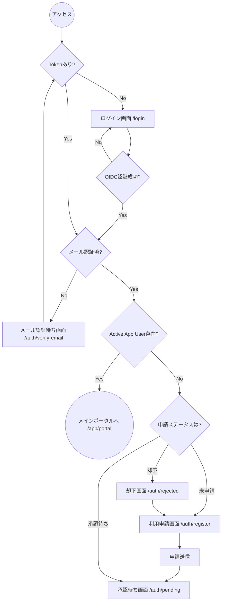
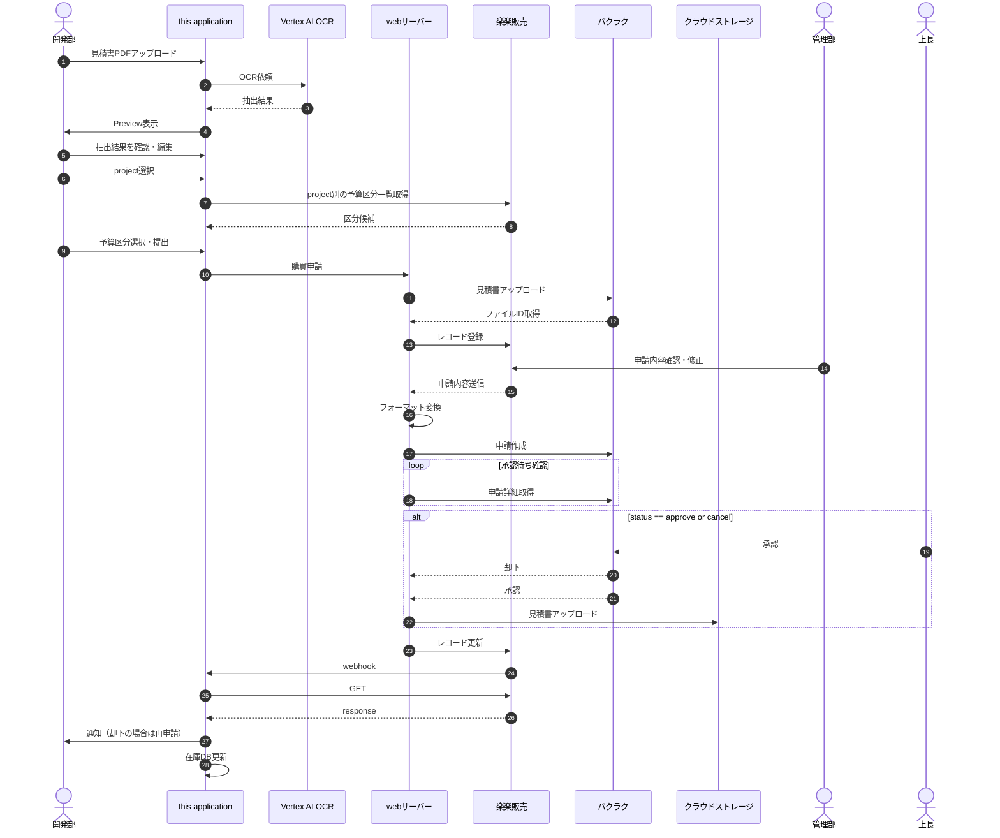
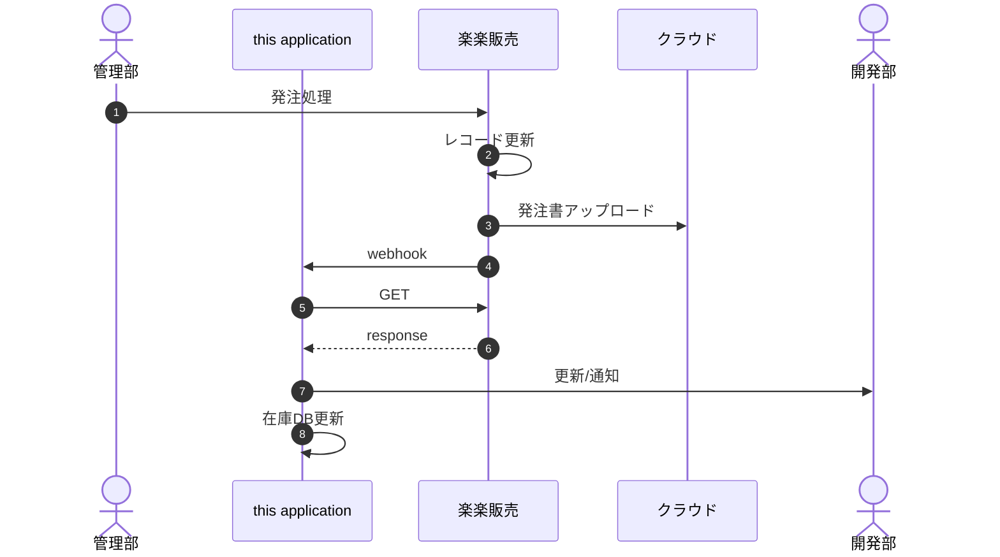
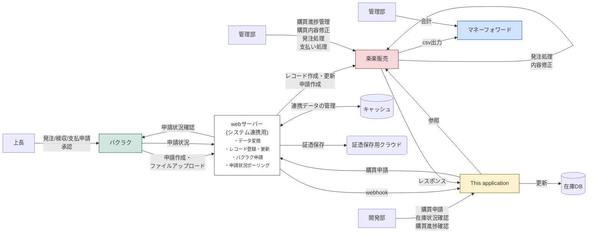

# Inventory Management System — Specification

# Requirement Precedence

When statements conflict, interpret in this order:
1. `documents/specification.md`
2. current code behavior

---

# 1. System Overview

本システムは**開発装置 (Device) に必要な部品・資材の在庫管理と調達追跡**を一元的に行う Web アプリケーションである。

主な責務:

- **在庫 (Inventory)** — 何がどこに何個あるか
- **所要量 (Requirements)** — 各スコープに何が何個必要か
- **引当・予約 (Reservations)** — 誰がどの部品をいつまで確保しているか
- **不足 (Shortage)** — 何がどれだけ足りないか
- **調達追跡 (Procurement)** — 見積書の OCR 取り込みから購買申請・承認・発注・入荷までの追跡

本システムは外部サーバー (integration web server) を介して楽楽販売・バクラクと連携し、Cloud Run 上で運用されることを想定している。現在、外部サーバーは未完成のため、連携箇所は adapter 境界にインターフェースとモック実装が用意されており、実 API 接続は未実装である。

---

# 2. Non-Functional Requirements

| Requirement | Specification |
|-------------|---------------|
| Target OS | Windows |
| Database | PostgreSQL 17+ (Docker Compose for local development). `pg_trgm` 拡張が必要 |
| Language (Backend) | Go 1.24+ |
| Backend HTTP | net/http (標準ライブラリ) |
| Backend DB Access | pgx / pgxpool + SQL-first queries (sqlc recommended, with handwritten SQL for complex searches) |
| Language (Frontend) | TypeScript |
| UI Framework | React 19 + React Router v7 |
| UI Styling | Tailwind CSS v4 + shadcn/ui (Radix Primitives) |
| Data Fetching | SWR |
| Form Handling | React Hook Form + Zod |
| Package Manager (Go) | Go Modules |
| Package Manager (Frontend) | npm |
| Frontend Builder | Vite |
| Frontend Testing | Vitest + Playwright |
| Authentication | Firebase Identity Platform (JWT/OIDC) |
| OCR | Google Vertex AI (Gemini) |
| Deploy Target | Google Cloud Run |
| CSV Encoding | UTF-8 (no BOM) or CP932 |

---

# 3. Deployment Architecture

## 3.1 System Components

### Frontend
- React SPA (served via nginx on Cloud Run)
- Backend との通信は REST API (`/api/...`)
- Bearer JWT 認証
- 2 モード:
  - **Local mode**: same-origin via reverse proxy
  - **Cloud mode**: direct API endpoint via `VITE_API_BASE`

### Backend (Go API Service)
単一 Go サービスで内部レイヤ構造を持つ:
```
HTTP Handler
  → Auth Middleware
    → Usecase (Application Layer)
      → Repository (DB)
      → Storage Interface (files/artifacts)
      → External Adapters (procurement dispatch, sync, OCR)
```

責務:
- HTTP request handling
- Authentication & authorization (JWT verification, RBAC)
- Business logic (usecases)
- Transaction management
- Persistence (PostgreSQL)
- Storage abstraction (local or GCS)
- Audit logging
- OCR ジョブ管理 (Vertex AI Gemini)
- 調達ステータスの local projection 管理

### Integration Layer (外部連携層)

外部連携 web server は本アプリケーションのコアランタイム外にある。

責務:
- 本アプリケーションからの見積書アップロード受付
- バクラクへの証憑アップロードと外部ファイル ID 取得
- 楽楽販売レコードの作成・更新
- 楽楽販売リクエストデータのバクラク申請ペイロードへの変換
- バクラクの承認状態変更ポーリング
- 承認済み・発注関連の証憑ファイルのクラウドストレージへのアップロード
- 再実行・照合に必要なキャッシュ/ステートの保持

### Data Layer

#### PostgreSQL
System of record:
- master data (items, suppliers, devices, scopes)
- transactional data (inventory_events, reservations, orders, procurement tracking projections)
- audit logs
- import jobs
- OCR jobs

#### Storage (Abstracted)
- `local://...` (ローカル開発)
- `gcs://...` (Cloud mode)
- 用途: uploaded files, generated artifacts (CSV/PDF), synchronized procurement evidence

#### External Systems
- **楽楽販売**: 調達レコード管理、webhook ソース
- **バクラク**: 承認ワークフロー、証憑ファイル連携
- **Cloud Storage**: 証憑・ドキュメントの長期保存
- **Money Forward**: 下流の会計エクスポート先 (本アプリの write scope 外)

## 3.2 Runtime Modes

### Local Mode
- Backend + DB + Frontend を Docker Compose で起動
- File storage はローカルファイルシステム
- Frontend は reverse proxy 経由で backend にアクセス

### Cloud Mode
- Backend は stateless container として Cloud Run にデプロイ
- Frontend は別 Cloud Run service として配信
- Storage は GCS
- CORS を明示設定
- 外部調達システムとの連携は integration web server 経由

## 3.3 Database Migration Strategy
- `golang-migrate` で管理
- migration は**別デプロイステップ**として実行 (Cloud Run Job)
- backend はランタイムでのスキーマ変更能力を前提としない

---

# 4. Authentication and Authorization

## 4.1 Authentication (AuthN)

全 API リクエストは `Authorization: Bearer <JWT>` を使用。

- Browser/API auth は Identity Platform email/password sign-in で Bearer token を取得
- 手動トークン入力はローカル/テスト用 fallback (`import.meta.env.DEV` が true の場合のみ表示)
- `OIDC_REQUIRE_EMAIL_VERIFIED=1` の場合、メール認証完了まで backend はトークンを拒否
- Frontend は以下をサポート:
  - アカウント作成
  - 確認メール送信/再送信
  - 未認証アカウント待機画面

## 4.2 Identity Resolution

JWT claims から application user へのマッピング:
- `email`
- `external_subject`
- `identity_provider`

`users` テーブルの対応行が存在し、かつ active でなければならない。

## 4.3 Self-Registration Flow

認証済み OIDC claims (email, sub, optional hd) が active app user に解決できない場合:
1. self-registration フロー (username, required display_name, requested role, optional memo)
2. Admin が Users ページから承認/却下
3. 却下された場合は理由を表示し、再申請可能
4. Bootstrap 例外: `POST /api/users` は active users が 0 の場合のみ Bearer auth を省略可能



## 4.4 Authorization (AuthZ)

Role-based access control (RBAC)。`user_roles` テーブルで割り当て。

制御モード:
- `AUTH_MODE`: bearer-token enforcement (`none`, `oidc_dry_run`, `oidc_enforced`)
- `RBAC_MODE`: role enforcement (`none`, `rbac_dry_run`, `rbac_enforced`)

### ロール定義

| Role | Key | Access |
|------|-----|--------|
| Admin | `admin` | 全機能、ユーザー承認、マスタ管理、統合設定 |
| Operator | `operator` | 所要量管理、shortage 確認、request 提出、在庫閲覧 |
| Acceptance Inspector | `receiving_inspector` | 入荷/検収ワークフロー |
| Auditor | `auditor` | 在庫/調達の read-only 閲覧 |

`Acceptance Inspector` は文書上の表示名。実装上の role key は `receiving_inspector` に統一。

`Operator / Inventory / Procurement / Admin` は画面区分であり、ユーザー権限そのものとは分けて扱う。各ユーザーは必要に応じて複数のアプリ区分へアクセス可能。

---

# 5. Database Schema

## 5.1 ER Diagram

```mermaid
erDiagram

    MANUFACTURERS {
        int manufacturer_id PK
        string name UK
        string created_at
        string updated_at
    }

    SUPPLIERS {
        int supplier_id PK
        string name UK
        string created_at
        string updated_at
    }

    DEPARTMENTS {
        int department_id PK
        string department_code UK
        string department_name UK
        string created_at
        string updated_at
    }

    ITEM_CATEGORIES {
        int category_id PK
        string canonical_name UK
        string created_at
        string updated_at
    }

    CATEGORY_ALIASES {
        int category_alias_id PK
        string alias_category UK
        int category_id FK
        string created_at
        string updated_at
    }

    ITEMS {
        int item_id PK
        string item_number UK
        int manufacturer_id FK
        int category_id FK
        int primary_department_id FK
        string engineering_domain
        string url
        string description
        string lifecycle_status
        string created_at
        string updated_at
    }

    SUPPLIER_ITEM_ALIASES {
        int alias_id PK
        int supplier_id FK
        string ordered_item_number
        int canonical_item_id FK
        int units_per_order
        string created_at
        string updated_at
    }

    DEVICES {
        int device_id PK
        string device_code UK
        string device_name UK
        string device_type
        string status
        string planned_start_at
        string created_at
        string updated_at
    }

    DEVICE_SCOPES {
        int scope_id PK
        int device_id FK
        int parent_scope_id FK
        string scope_code UK
        string scope_name
        string scope_type
        int owner_department_id FK
        string status
        string planned_start_at
        string planned_end_at
        string created_at
        string updated_at
    }

    SCOPE_DEPARTMENTS {
        int scope_department_id PK
        int scope_id FK
        int department_id FK
        string involvement_type
        string created_at
    }

    LOCATIONS {
        int location_id PK
        string code UK
        string name
        string location_type
        bool is_active
        string created_at
        string updated_at
    }

    INVENTORY_BALANCES {
        int inventory_balance_id PK
        int item_id FK
        int location_id FK
        int on_hand_quantity
        int reserved_quantity
        int available_quantity
        string updated_at
    }

    INVENTORY_EVENTS {
        int inventory_event_id PK
        string event_type
        int item_id FK
        int from_location_id FK
        int to_location_id FK
        int quantity
        int actor_user_id FK
        string source_type
        int source_id
        string correlation_id
        int reversed_by_event_id FK
        string note
        string occurred_at
    }

    INVENTORY_EVENT_LINKS {
        int link_id PK
        int inventory_event_id FK
        string linked_entity_type
        int linked_entity_id
        string created_at
    }

    ASSEMBLIES {
        int assembly_id PK
        string assembly_code UK
        string name UK
        string description
        string created_at
        string updated_at
    }

    ASSEMBLY_COMPONENTS {
        int assembly_id PK
        int item_id PK
        int quantity
        string created_at
    }

    SCOPE_ASSEMBLY_REQUIREMENTS {
        int requirement_id PK
        int scope_id FK
        int assembly_id FK
        int quantity
        string note
        string created_at
        string updated_at
    }

    SCOPE_ITEM_REQUIREMENTS {
        int requirement_id PK
        int scope_id FK
        int item_id FK
        int quantity
        string note
        string created_at
        string updated_at
    }

    SCOPE_ASSEMBLY_USAGE {
        int usage_id PK
        int scope_id FK
        int location_id FK
        int assembly_id FK
        int quantity
        string note
        string updated_at
    }

    PROCUREMENT_BATCHES {
        int batch_id PK
        int device_id FK
        int scope_id FK
        string status
        string target_date
        string note
        string created_at
        string updated_at
    }

    PROCUREMENT_LINES {
        int procurement_line_id PK
        int batch_id FK
        int item_id FK
        int preferred_supplier_id FK
        string raku_project_code
        string budget_category_code
        string budget_category_name
        int required_quantity
        int planned_order_quantity
        string status
        string expected_arrival_date
        int linked_purchase_order_line_id FK
        string note
        string created_at
        string updated_at
    }

    PROCUREMENT_STATUS_PROJECTIONS {
        int procurement_status_projection_id PK
        int procurement_line_id FK
        string external_system
        string external_record_id
        string external_status_raw
        string normalized_status
        int requested_quantity
        int approved_quantity
        int ordered_quantity
        int received_quantity
        string expected_arrival_date
        string last_synced_at
        string external_updated_at
        int projection_version
        string raw_payload_json
        string created_at
        string updated_at
    }

    PROCUREMENT_STATUS_HISTORY {
        int procurement_status_history_id PK
        int procurement_line_id FK
        string external_system
        string external_record_id
        string external_status_raw
        string normalized_status
        string payload_json
        string observed_at
        string created_at
    }

    EXTERNAL_PROJECTS {
        int external_project_id PK
        string source_system
        string project_code
        string project_name
        bool is_active
        string raw_payload_json
        string synced_at
        string created_at
        string updated_at
    }

    EXTERNAL_PROJECT_BUDGET_CATEGORIES {
        int external_project_budget_category_id PK
        int external_project_id FK
        string category_code
        string category_name
        int display_order
        bool is_active
        string raw_payload_json
        string synced_at
        string created_at
        string updated_at
    }

    SUPPLIER_QUOTATIONS {
        int quotation_id PK
        int supplier_id FK
        string quotation_number
        string issue_date
        string document_artifact_id
        string status
        string created_at
        string updated_at
    }

    SUPPLIER_QUOTATION_LINES {
        int quotation_line_id PK
        int quotation_id FK
        int item_id FK
        int supplier_item_alias_id FK
        string quoted_item_number
        int quoted_quantity
        string unit_price
        string currency
        string note
        string created_at
        string updated_at
    }

    PURCHASE_ORDERS {
        int purchase_order_id PK
        int supplier_id FK
        string purchase_order_number
        string document_artifact_id
        string issued_at
        string status
        string created_at
        string updated_at
    }

    PURCHASE_ORDER_LINES {
        int purchase_order_line_id PK
        int purchase_order_id FK
        int item_id FK
        int supplier_item_alias_id FK
        int quotation_line_id FK
        string ordered_item_number
        int ordered_quantity
        int received_quantity
        string unit_price
        string currency
        string expected_arrival_date
        string status
        string note
        string created_at
        string updated_at
    }

    PURCHASE_ORDER_LINE_LINEAGE_EVENTS {
        int lineage_event_id PK
        string event_type
        int source_line_id FK
        int target_line_id FK
        int quantity
        string metadata_json
        string created_at
    }

    RECEIPTS {
        int receipt_id PK
        int purchase_order_id FK
        string receipt_number
        string source_type
        int received_by_user_id FK
        string received_at
        string note
        string created_at
    }

    RECEIPT_LINES {
        int receipt_line_id PK
        int receipt_id FK
        int purchase_order_line_id FK
        int item_id FK
        int location_id FK
        int received_quantity
        string note
        string created_at
    }

    RESERVATIONS {
        int reservation_id PK
        int item_id FK
        int scope_id FK
        int requested_by_user_id FK
        int quantity
        string status
        string purpose
        string priority
        string needed_by_at
        string planned_use_at
        string hold_until_at
        string fulfilled_at
        string released_at
        string cancellation_reason
        string created_at
        string updated_at
    }

    RESERVATION_ALLOCATIONS {
        int allocation_id PK
        int reservation_id FK
        int item_id FK
        int location_id FK
        int purchase_order_line_id FK
        string source_type
        int quantity
        string status
        string allocated_at
        string released_at
        string note
    }

    RESERVATION_EVENTS {
        int reservation_event_id PK
        int reservation_id FK
        string event_type
        int quantity
        int actor_user_id FK
        string metadata_json
        string occurred_at
    }

    IMPORT_JOBS {
        int import_job_id PK
        string import_type
        string source_name
        string source_artifact_id
        int continue_on_error
        string status
        string lifecycle_state
        int redo_of_job_id FK
        int created_by_user_id FK
        string created_at
        string undone_at
    }

    IMPORT_ROWS {
        int import_row_id PK
        int import_job_id FK
        int row_number
        string raw_payload_json
        string normalized_payload_json
        string status
        string code
        string message
        string created_at
    }

    IMPORT_EFFECTS {
        int import_effect_id PK
        int import_job_id FK
        int import_row_id FK
        string target_entity_type
        int target_entity_id
        string effect_type
        string before_state_json
        string after_state_json
        string created_at
    }

    ROLES {
        int role_id PK
        string role_name UK
        string created_at
        string updated_at
    }

    USERS {
        int user_id PK
        string username UK
        string display_name
        string email UK
        string identity_provider
        string external_subject
        string hosted_domain
        bool is_active
        string created_at
        string updated_at
    }

    USER_ROLES {
        int user_role_id PK
        int user_id FK
        int role_id FK
        string created_at
    }

    AUDIT_EVENTS {
        int audit_event_id PK
        string occurred_at
        int actor_user_id FK
        string actor_role
        string action_type
        string target_entity_type
        int target_entity_id
        string result
        string request_id
        string correlation_id
        string metadata_json
    }

    MANUFACTURERS ||--o{ ITEMS : owns
    ITEM_CATEGORIES ||--o{ ITEMS : classifies
    ITEM_CATEGORIES ||--o{ CATEGORY_ALIASES : normalizes
    DEPARTMENTS ||--o{ ITEMS : primary_owner
    SUPPLIERS ||--o{ SUPPLIER_ITEM_ALIASES : provides_aliases
    ITEMS ||--o{ SUPPLIER_ITEM_ALIASES : canonical_target
    DEVICES ||--o{ DEVICE_SCOPES : contains
    DEVICE_SCOPES ||--o{ DEVICE_SCOPES : parent_of
    DEPARTMENTS ||--o{ DEVICE_SCOPES : owns_scope
    DEVICE_SCOPES ||--o{ SCOPE_DEPARTMENTS : includes_departments
    DEPARTMENTS ||--o{ SCOPE_DEPARTMENTS : participates_in_scope
    ITEMS ||--o{ INVENTORY_BALANCES : stored_as_balance
    LOCATIONS ||--o{ INVENTORY_BALANCES : stores
    ITEMS ||--o{ INVENTORY_EVENTS : affected_item
    LOCATIONS ||--o{ INVENTORY_EVENTS : from_location
    LOCATIONS ||--o{ INVENTORY_EVENTS : to_location
    INVENTORY_EVENTS ||--o{ INVENTORY_EVENTS : reversed_by
    INVENTORY_EVENTS ||--o{ INVENTORY_EVENT_LINKS : has_links
    ASSEMBLIES ||--o{ ASSEMBLY_COMPONENTS : has_components
    ITEMS ||--o{ ASSEMBLY_COMPONENTS : component_item
    DEVICE_SCOPES ||--o{ SCOPE_ASSEMBLY_REQUIREMENTS : requires_assembly
    ASSEMBLIES ||--o{ SCOPE_ASSEMBLY_REQUIREMENTS : required_assembly
    DEVICE_SCOPES ||--o{ SCOPE_ITEM_REQUIREMENTS : requires_item
    ITEMS ||--o{ SCOPE_ITEM_REQUIREMENTS : required_item
    DEVICE_SCOPES ||--o{ SCOPE_ASSEMBLY_USAGE : uses_assemblies
    LOCATIONS ||--o{ SCOPE_ASSEMBLY_USAGE : used_in_location
    ASSEMBLIES ||--o{ SCOPE_ASSEMBLY_USAGE : deployed_assembly
    DEVICES ||--o{ PROCUREMENT_BATCHES : procurement_context
    DEVICE_SCOPES ||--o{ PROCUREMENT_BATCHES : procurement_scope
    PROCUREMENT_BATCHES ||--o{ PROCUREMENT_LINES : has_lines
    ITEMS ||--o{ PROCUREMENT_LINES : procured_item
    SUPPLIERS ||--o{ PROCUREMENT_LINES : preferred_supplier
    PURCHASE_ORDER_LINES ||--o{ PROCUREMENT_LINES : fulfills_plan
    SUPPLIERS ||--o{ SUPPLIER_QUOTATIONS : issues
    SUPPLIER_QUOTATIONS ||--o{ SUPPLIER_QUOTATION_LINES : has_lines
    ITEMS ||--o{ SUPPLIER_QUOTATION_LINES : quoted_item
    SUPPLIER_ITEM_ALIASES ||--o{ SUPPLIER_QUOTATION_LINES : quoted_alias
    SUPPLIERS ||--o{ PURCHASE_ORDERS : receives_order
    PURCHASE_ORDERS ||--o{ PURCHASE_ORDER_LINES : has_lines
    ITEMS ||--o{ PURCHASE_ORDER_LINES : ordered_item
    SUPPLIER_ITEM_ALIASES ||--o{ PURCHASE_ORDER_LINES : ordered_alias
    SUPPLIER_QUOTATION_LINES ||--o{ PURCHASE_ORDER_LINES : based_on_quote
    PURCHASE_ORDER_LINES ||--o{ PURCHASE_ORDER_LINE_LINEAGE_EVENTS : lineage_source
    PURCHASE_ORDER_LINES ||--o{ PURCHASE_ORDER_LINE_LINEAGE_EVENTS : lineage_target
    PURCHASE_ORDERS ||--o{ RECEIPTS : grouped_receipts
    RECEIPTS ||--o{ RECEIPT_LINES : has_lines
    PURCHASE_ORDER_LINES ||--o{ RECEIPT_LINES : received_against
    ITEMS ||--o{ RECEIPT_LINES : received_item
    LOCATIONS ||--o{ RECEIPT_LINES : received_into
    DEVICE_SCOPES ||--o{ RESERVATIONS : reserved_for_scope
    ITEMS ||--o{ RESERVATIONS : reserved_item
    RESERVATIONS ||--o{ RESERVATION_ALLOCATIONS : allocates
    ITEMS ||--o{ RESERVATION_ALLOCATIONS : allocated_item
    LOCATIONS ||--o{ RESERVATION_ALLOCATIONS : allocated_from
    RESERVATIONS ||--o{ RESERVATION_EVENTS : has_events
    IMPORT_JOBS ||--o{ IMPORT_ROWS : contains_rows
    IMPORT_JOBS ||--o{ IMPORT_EFFECTS : creates_effects
    IMPORT_ROWS ||--o{ IMPORT_EFFECTS : row_effects
    IMPORT_JOBS ||--o{ IMPORT_JOBS : redo_chain
    USERS ||--o{ USER_ROLES : assigned_roles
    ROLES ||--o{ USER_ROLES : role_members
    USERS ||--o{ INVENTORY_EVENTS : performs_inventory_actions
    USERS ||--o{ RESERVATION_EVENTS : performs_reservation_actions
    USERS ||--o{ IMPORT_JOBS : starts_imports
    USERS ||--o{ RECEIPTS : receives_goods
    USERS ||--o{ RESERVATIONS : requests_reservations
    USERS ||--o{ AUDIT_EVENTS : performs_audit_actions
```



## 5.2 Table Details

### Master / Catalog Tables

#### `manufacturers`
- `manufacturer_id` bigint PK
- `name` varchar(255) not null unique
- `created_at`, `updated_at` timestamptz

#### `suppliers`
- `supplier_id` bigint PK
- `name` varchar(255) not null unique
- `created_at`, `updated_at` timestamptz

#### `departments`
- `department_id` bigint PK
- `department_code` varchar(64) not null unique — 例: `OPTICS`, `CONTROLS`, `MECHANICAL`
- `department_name` varchar(255) not null unique
- `created_at`, `updated_at` timestamptz

#### `item_categories`
- `category_id` bigint PK
- `canonical_name` varchar(255) not null unique
- `created_at`, `updated_at` timestamptz

#### `category_aliases`
カテゴリ名のゆらぎを正規化するテーブル。
- `category_alias_id` bigint PK
- `alias_category` varchar(255) not null unique
- `category_id` bigint not null FK → `item_categories`
- `created_at`, `updated_at` timestamptz

#### `items`
全装置共通のアイテムマスタ。
- `item_id` bigint PK
- `item_number` varchar(255) not null unique
- `manufacturer_id` bigint null FK → `manufacturers`
- `category_id` bigint not null FK → `item_categories`
- `primary_department_id` bigint null FK → `departments` — 分類用。実際の割当は scope 関連テーブル
- `engineering_domain` varchar(64) null
- `url` text null
- `description` text null
- `lifecycle_status` varchar(64) not null default `'active'` — `active`, `inactive`, `obsolete`, `prototype`
- `created_at`, `updated_at` timestamptz
- 運用上のアイテム作成には少なくとも manufacturer, canonical item number, description, item category が必要

#### `supplier_item_aliases`
仕入先固有の品番と canonical item のマッピング。
- `alias_id` bigint PK
- `supplier_id` bigint not null FK → `suppliers`
- `ordered_item_number` varchar(255) not null
- `canonical_item_id` bigint not null FK → `items`
- `units_per_order` integer not null default 1 — check: > 0
- unique (`supplier_id`, `ordered_item_number`)
- 例: canonical item `ER2`, supplier ordered item number `ER2-P4`, `units_per_order = 4`

### Device / Scope Structure

#### `devices`
開発中の装置・製品。
- `device_id` bigint PK
- `device_code` varchar(64) not null unique
- `device_name` varchar(255) not null unique
- `device_type` varchar(64) null
- `status` varchar(64) not null default `'active'` — `planning`, `active`, `paused`, `completed`, `archived`
- `planned_start_at` timestamptz null
- `created_at`, `updated_at` timestamptz

#### `device_scopes`
装置内のサブシステム/モジュール/領域。`parent_scope_id` による階層構造 (subscope) をサポート。
- `scope_id` bigint PK
- `device_id` bigint not null FK → `devices`
- `parent_scope_id` bigint null FK → `device_scopes` (self-ref)
- `scope_code` varchar(128) not null — unique (`device_id`, `scope_code`)
- `scope_name` varchar(255) not null
- `scope_type` varchar(64) not null — `device_root`, `subsystem`, `module`, `area`, `work_package`
- `owner_department_id` bigint null FK → `departments`
- `status` varchar(64) not null default `'active'` — `planning`, `active`, `paused`, `completed`, `archived`
- `planned_start_at`, `planned_end_at` timestamptz null
- `created_at`, `updated_at` timestamptz

#### `scope_departments`
部署と scope の多対多参加。
- `scope_department_id` bigint PK
- `scope_id` bigint not null FK → `device_scopes`
- `department_id` bigint not null FK → `departments`
- `involvement_type` varchar(64) not null — `owner`, `support`, `reviewer`, `consumer`
- unique (`scope_id`, `department_id`, `involvement_type`)

### Location / Inventory Tables

#### `locations`
- `location_id` bigint PK
- `code` varchar(64) not null unique
- `name` varchar(255) not null
- `location_type` varchar(64) not null — `warehouse`, `lab`, `shelf`, `cabinet`, `device`, `in_transit`, `virtual`
- `is_active` boolean not null default true
- `created_at`, `updated_at` timestamptz

#### `inventory_balances`
現在在庫の projection テーブル。source of truth は `inventory_events`。
- `inventory_balance_id` bigint PK
- `item_id` bigint not null FK → `items`
- `location_id` bigint not null FK → `locations`
- unique (`item_id`, `location_id`)
- `on_hand_quantity`, `reserved_quantity`, `available_quantity` integer not null default 0 — 全て >= 0
- `updated_at` timestamptz

#### `inventory_events`
Immutable domain events。append-only。
- `inventory_event_id` bigint PK
- `event_type` varchar(64) not null — `receive`, `move`, `adjust`, `consume`, `reserve_allocate`, `reserve_release`, `undo`
- `item_id` bigint not null FK → `items`
- `from_location_id`, `to_location_id` bigint null FK → `locations` — 両方 non-null の場合 from ≠ to
- `quantity` integer not null — > 0
- `actor_user_id` bigint null FK → `users`
- `source_type` varchar(64) null, `source_id` bigint null
- `correlation_id` varchar(128) null
- `reversed_by_event_id` bigint null FK → `inventory_events` (self-ref)
- `note` text null
- `occurred_at` timestamptz not null default now()

#### `inventory_event_links`
在庫イベントとビジネスエンティティの汎用リンク。
- `link_id` bigint PK
- `inventory_event_id` bigint not null FK → `inventory_events`
- `linked_entity_type` varchar(64) not null
- `linked_entity_id` bigint not null
- unique (`inventory_event_id`, `linked_entity_type`, `linked_entity_id`)

### Assemblies / Requirements

#### `assemblies`
再利用可能なアセンブリ/BOM 単位。
- `assembly_id` bigint PK
- `assembly_code` varchar(128) not null unique
- `name` varchar(255) not null unique
- `description` text null

#### `assembly_components`
- PK (`assembly_id`, `item_id`)
- `quantity` integer not null — > 0

#### `scope_item_requirements`
scope 単位の品目所要量。
- `requirement_id` bigint PK
- `scope_id` bigint not null FK → `device_scopes`
- `item_id` bigint not null FK → `items`
- `quantity` integer not null — > 0
- `note` text null

#### `scope_assembly_requirements`
scope 単位のアセンブリ所要量。
- `requirement_id` bigint PK
- `scope_id` FK, `assembly_id` FK, `quantity`, `note`

#### `scope_assembly_usage`
scope でのアセンブリ実使用/配備。
- `usage_id` bigint PK
- `scope_id` FK, `location_id` FK, `assembly_id` FK
- `quantity` integer not null — >= 0
- `note` text null

### Procurement / Quotation / Purchasing

#### `supplier_quotations`
- `quotation_id` bigint PK
- `supplier_id` FK, `quotation_number`, `issue_date`, `document_artifact_id`, `status`
- unique (`supplier_id`, `quotation_number`)

#### `supplier_quotation_lines`
- `quotation_line_id` bigint PK
- `quotation_id` FK, `item_id` FK null, `supplier_item_alias_id` FK null
- `quoted_item_number`, `quoted_quantity`, `unit_price` numeric(18,4), `currency`, `note`

#### `purchase_orders`
外部から同期された注文を含む。
- `purchase_order_id` bigint PK
- `supplier_id` FK, `purchase_order_number` unique, `document_artifact_id`, `issued_at`, `status`
- status: `draft`, `issued`, `partially_received`, `received`, `cancelled`

#### `purchase_order_lines`
- `purchase_order_line_id` bigint PK
- `purchase_order_id` FK, `item_id` FK null, `supplier_item_alias_id` FK null, `quotation_line_id` FK null
- `ordered_item_number`, `ordered_quantity`, `received_quantity`, `unit_price`, `currency`
- `expected_arrival_date`, `status`, `note`

#### `purchase_order_line_lineage_events`
PO line の split/merge/replace 系譜。
- `lineage_event_id` bigint PK
- `event_type` — `split`, `merge`, `replace`, `cancel`, `carry_forward`
- `source_line_id` FK null, `target_line_id` FK null, `quantity`, `metadata_json`

#### `procurement_batches`
shortage 起因の調達要求グルーピング。
- `batch_id` bigint PK
- `device_id` FK, `scope_id` FK null (nullable = device-wide or shared procurement)
- `status` — `draft`, `review`, `submitted`, `under_review`, `approved`, `rejected`, `ordered`, `partially_received`, `received`, `closed`, `cancelled`
- `target_date`, `note`

#### `procurement_lines`
- `procurement_line_id` bigint PK
- `batch_id` FK, `item_id` FK, `preferred_supplier_id` FK null
- `raku_project_code` varchar(128) null — 楽楽販売 project context
- `budget_category_code` varchar(128) null, `budget_category_name` varchar(255) null
- `required_quantity`, `planned_order_quantity`, `status`, `expected_arrival_date`
- `linked_purchase_order_line_id` FK null — 外部同期された PO line への参照
- `note`
- 申請意図とユーザー確認済み提出値を格納。現在の外部ワークフロー状態は `procurement_status_projections` 経由で解決

#### `procurement_status_projections`
外部調達ワークフロー状態の local projection。UI とshortage計算はこのテーブルを参照。
- `procurement_status_projection_id` bigint PK
- `procurement_line_id` FK, `external_system`, `external_record_id`
- unique (`external_system`, `external_record_id`)
- `external_status_raw`, `normalized_status` — `draft`, `submitted`, `under_review`, `approved`, `rejected`, `ordered`, `partially_received`, `received`, `cancelled`
- `requested_quantity`, `approved_quantity`, `ordered_quantity`, `received_quantity` — 全て >= 0
- `expected_arrival_date`, `last_synced_at`, `external_updated_at`, `projection_version`
- `raw_payload_json` jsonb null

#### `procurement_status_history`
Append-only の同期状態変更履歴。
- `procurement_status_history_id` bigint PK
- `procurement_line_id` FK, `external_system`, `external_record_id`
- `external_status_raw`, `normalized_status`, `payload_json`, `observed_at`

#### `external_projects`
楽楽販売等から同期されたプロジェクトマスタのローカルキャッシュ。
- `external_project_id` bigint PK
- `source_system`, `project_code`, `project_name`, `is_active`
- unique (`source_system`, `project_code`)
- `raw_payload_json`, `synced_at`

#### `external_project_budget_categories`
プロジェクト別の予算区分選択肢。
- `external_project_budget_category_id` bigint PK
- `external_project_id` FK, `category_code`, `category_name`
- unique (`external_project_id`, `category_code`)
- `display_order`, `is_active`, `raw_payload_json`, `synced_at`

### Receipts

#### `receipts`
- `receipt_id` bigint PK
- `purchase_order_id` FK null, `receipt_number` unique null
- `source_type` — `purchase_order`, `manual`, `return`, `transfer`
- `received_by_user_id` FK null, `received_at`, `note`

#### `receipt_lines`
- `receipt_line_id` bigint PK
- `receipt_id` FK, `purchase_order_line_id` FK null, `item_id` FK, `location_id` FK
- `received_quantity` integer not null — > 0
- `note`

### Reservations

#### `reservations`
- `reservation_id` bigint PK
- `item_id` FK, `scope_id` FK, `requested_by_user_id` FK null
- `quantity` integer not null — > 0
- `status` — `requested`, `partially_allocated`, `allocated`, `fulfilled`, `released`, `cancelled`, `expired`
- `purpose` text null
- `priority` — `low`, `normal`, `high`, `critical`
- `needed_by_at` — ビジネス上の必要日。緊急度判断に使用
- `planned_use_at` — 使用予定日
- `hold_until_at` — 確保維持期限。auto-release 提案に使用
- `fulfilled_at`, `released_at` timestamptz null
- `cancellation_reason` text null

#### `reservation_allocations`
- `allocation_id` bigint PK
- `reservation_id` FK, `item_id` FK, `location_id` FK
- `purchase_order_line_id` FK null — 将来入荷からの割当
- `source_type` text not null default `'stock'` — `stock`, `incoming_order`
- `quantity` integer not null — > 0
- `status` — `allocated`, `released`, `consumed`, `cancelled`
- `allocated_at`, `released_at`, `note`

#### `reservation_events`
- `reservation_event_id` bigint PK
- `reservation_id` FK, `event_type`, `quantity`, `actor_user_id` FK null
- `event_type` — `created`, `allocated`, `partially_allocated`, `fulfilled`, `released`, `cancelled`, `expired`, `consumed`
- `metadata_json` jsonb null, `occurred_at`

### Import Tables

#### `import_jobs`
- `import_job_id` bigint PK
- `import_type` varchar(64) not null — shortage/requirements CSV, item master CSV, supplier alias CSV
- `source_name`, `source_artifact_id`
- `continue_on_error` boolean not null default false
- `status` — `created`, `running`, `completed`, `failed`, `undone`
- `lifecycle_state` — `active`, `superseded`, `undone`
- `redo_of_job_id` FK null, `created_by_user_id` FK null
- `undone_at` timestamptz null

#### `import_rows`
- `import_row_id` bigint PK
- `import_job_id` FK, `row_number` integer — unique (`import_job_id`, `row_number`)
- `raw_payload_json`, `normalized_payload_json`
- `status` — `parsed`, `validated`, `warning`, `error`, `applied`, `skipped`
- `code`, `message`

#### `import_effects`
- `import_effect_id` bigint PK
- `import_job_id` FK, `import_row_id` FK null
- `target_entity_type`, `target_entity_id`, `effect_type`
- `before_state_json`, `after_state_json`

### Identity / Access

#### `users`
- `user_id` bigint PK
- `username` varchar(128) not null unique
- `display_name` varchar(255) not null
- `email` varchar(255) not null unique
- `identity_provider`, `external_subject`, `hosted_domain`
- unique (`identity_provider`, `external_subject`) where both non-null
- `is_active` boolean not null default true

#### `roles`
- `role_id` bigint PK
- `role_name` varchar(64) not null unique — 例: `admin`, `operator`, `receiving_inspector`, `auditor`

#### `user_roles`
- `user_role_id` bigint PK
- `user_id` FK, `role_id` FK — unique (`user_id`, `role_id`)

### Audit

#### `audit_events`
- `audit_event_id` bigint PK
- `occurred_at`, `actor_user_id` FK null, `actor_role`
- `action_type`, `target_entity_type`, `target_entity_id`
- `result` — `success`, `failure`, `denied`
- `request_id`, `correlation_id`, `metadata_json`

---

# 6. Inventory and Undo Model

## 6.1 Core Principles

在庫は以下でモデル化:
- **Current state (projection)**: `inventory_balances`
- **Immutable event log**: `inventory_events`
- **Audit log**: `audit_events`

Append-only + compensating transaction model を採用。

## 6.2 Event Types
`receive`, `move`, `adjust`, `consume`, `reserve_allocate`, `reserve_release`, `undo`

## 6.3 Write Flow
1. DB transaction 開始
2. 関連行をロック (inventory / reservation)
3. 制約バリデーション (availability, feasibility)
4. `inventory_event` 挿入
5. `inventory_balances` 更新
6. `audit_event` 挿入
7. Commit

## 6.4 Concurrency Control
- 全 write operations は explicit DB transactions 内で実行
- Row-level locks (`SELECT ... FOR UPDATE`)
- Lock ordering: item → reservation → order

## 6.5 Undo Model
Undo = 補償コマンドの実行。新しい reversing events を生成する first-class operation。

例:
- Undo Move: `A → B (10)` → `B → A (10)`
- Undo Consume: `consume A -10` → `adjust A +10`

部分 Undo にも対応 (より少ない quantity の compensating events を生成)。

Undo usecase: `UndoInventoryEvent`, `UndoReservation`, `UndoReceipt`, `UndoImportJob`

各 usecase は: 元イベントをロード → feasibility check (十分な在庫、予約状態の可逆性、下流イベントとの競合なし) → compensating events 生成 → transactional apply

## 6.6 Snapshot Calculation

Current state: `inventory_balances`

Projected state (target_date 指定時):
```
on_hand
+ incoming (expected_arrival_date <= target_date の PO lines 未入荷分)
- reserved (active reservations の確保分)
```
location 別に集計。requirements は計画段階の変動値のため含めない (shortage 画面で別途確認可能)。

---

# 7. Frontend Specification

## 7.1 High-Level UX Architecture

### Application Segments

| Segment | Purpose |
|---------|---------|
| **Operator** | 所要量管理、引当、shortage 確認、import |
| **Inventory** | 在庫操作、残高確認、イベント履歴 |
| **Procurement** | 購買申請作成、OCR、外部ステータス追跡 |
| **Inspector** | 入荷検収 |
| **Admin** | ユーザー管理、マスタ設定 |

### Navigation
```
[ Portal ] [ Operator ] [ Inventory ] [ Procurement ] [ Inspector ] [ Admin ]
```

### Global Context
Device / Scope 文脈は全画面必須ではない。部品管理・割当・申請区分など文脈依存の強い画面では Context Bar を表示し、Portal / Admin / Auth では非表示または簡略表示。

```
Device: [A号機 ▼]  Scope: [光学系 / 光路 ▼]  User: [Name]
```

URL クエリまたはパスパラメータで文脈復元。

## 7.2 Core UX Principles

1. **Purpose-Oriented Design** — Operator → decide, Inventory → stock, Procurement → request/track, Admin → configure
2. **Device-Centric Navigation** — Device → Scope → Action
3. **Context-Aware Actions** — 全操作に Device/Scope/Item を含む
4. **Timeline Visibility** — 主要エンティティのイベント履歴を表示

## 7.3 Routing Structure

### Auth Routes (`/auth/*`)
- `/auth/login` — ログイン
- `/auth/verify-email` — メールアドレス確認要求
- `/auth/register` — アカウント本登録
- `/auth/pending` — 管理者承認待ち
- `/auth/rejected` — 承認却下表示・再申請

### App Routes (`/app/*`)
- `/app/portal` — 全ユーザー共通ポータル

**Operator**:
- `/app/operator/requirements` — 要求一覧・作成
- `/app/operator/reservations` — 予約状況管理
- `/app/operator/shortage` — 不足品確認、CSV 出力、既存 request 確認
- `/app/operator/imports/upload` — import アップロード
- `/app/operator/imports/history` — import 履歴
- `/app/operator/scopes` — scope 概要一覧 (ツリー + サマリカウント)

**Inventory**:
- `/app/inventory/items` — アイテム別在庫
- `/app/inventory/locations` — ロケーション別在庫
- `/app/inventory/events` — 入庫/移動/調整の実行・履歴
- `/app/inventory/items/{id}/flow` — 品目別増減タイムライン
- `/app/inventory/arrivals/calendar` — 入荷カレンダー

**Procurement**:
- `/app/procurement/requests` — 購買リクエスト一覧
- `/app/procurement/requests/[id]` — 購買リクエスト詳細
- `/app/procurement/ocr-queue` — 見積書アップロード・OCR結果編集
- `/app/procurement/drafts/[id]` — 明細区分入力 (予算・物品区分)

**Inspector**:
- `/app/inspector/arrivals` — 入荷確認・検収

**Admin**:
- `/app/admin/users` — ユーザー管理 (利用申請の承認/却下)
- `/app/admin/roles` — ロール・権限管理
- `/app/admin/master` — マスタ管理

## 7.4 Operator App

### Scope Overview
scope ツリーを一覧表示し、各 scope の要約数値を確認。クリックで詳細遷移。

各ノードのサマリ:
- Requirements count
- Reservations count
- Shortage item count (actionable shortage > 0 の品目数)
- Owner department

### Requirements Page
scope ごとの所要量。CSV import / export 対応。

import 時に DB 未登録の item が含まれる場合は、inline で item 登録ダイアログを提供 (画面遷移不要)。

### Reservations Page
- Create / Release / Adjust quantity
- CSV export
- source_type 列 (stock / incoming_order)
- 紐づけ PO 番号表示
- Reservation が将来入荷も考慮: reservation 開始日付が未来の場合、その日付までに available になる物品 (orders からの自動割当) も対象。preview 画面を経由。

### Shortage Page (Core Feature)

Columns:
```
Item | Required | Reserved | Available | Raw Shortage | In Request Flow | Ordered | Received | Actionable Shortage
```

Formula:
```
raw_shortage = required - reserved - available
pipeline_covered = quantity in procurement status projection
actionable_shortage = max(0, raw_shortage - pipeline_covered_for_selected_threshold)
```

Coverage rule (configurable):
- Exclude nothing
- Exclude quantities already `submitted`
- Exclude quantities already `approved` (recommended default)
- Exclude quantities already `ordered`
- Exclude quantities already `received`

Features:
- Filter by scope
- Sort by actionable shortage
- Export shortage rows as CSV (columns: device, scope, manufacturer, item_number, description, quantity)
- Open existing procurement requests for the row
- Shortage Timeline: scope 開始日前後の分解表示 (開始日までに使用可能な分 vs delay して使用可能になる分。後者は月日と個数も表示)

### Scope-Level Decision Flow
1. Requirements と Reservations を scope context で確認
2. Shortage page を開く
3. shortage が in-flight procurement でカバーされているか判断
4. カバーされていなければ shortage rows を CSV export し、外部で見積書を取得
5. 見積書 PDF が準備できたら Procurement App で OCR-assisted request 作成
6. 在庫操作が必要な場合は Inventory App へ

## 7.5 Inventory App

### Overview Views
- By Item — Item × Location
- By Location — Location × Item
- By Device — Device × Category
- By Department — Department × Quantity

### Inventory Operations
- Receive / Move / Adjust
- Undo UI (直近の操作履歴と Undo ボタン)

### Item Flow
品目別の増減タイムライン: 日付、イベント種別、数量変動、残高、ソース参照。
例: `2026/05/10: +10 (arrival:PO_number), 2026/05/12: -20 (reservation)`

### Arrival Calendar
PO line の expected_arrival_date をカレンダー表示。日付クリックで詳細 (item, quantity, PO number, quotation number, supplier)。

### Inventory Movements
`inventory_events` ベースのタイムライン表示。

### Export
CSV export、filtered views。

## 7.6 Procurement App

### Procurement Requests List
Columns: Item, Requested Quantity, Request Status, External Request ID, Last Synced At, Expected Arrival

Actions: Create from OCR, Open detail, Retry/resubmit, Refresh local projection

### Procurement Request Detail
- User-confirmed request payload
- OCR source file and preview result
- Selected project, budget category
- 楽楽販売/バクラク linkage identifiers
- normalized status / raw external status
- Quantity progression: requested → approved → ordered → received
- Status history timeline
- Linked purchase order / receipt information

### Procurement Request Creation Flow

**Step 1 (OCR Preview)**:
左右分割。左: PDF プレビュー、右: Gemini 抽出データフォーム。
- Quotation 単位: supplier, quotation number, issue date
- Row 単位 OCR 抽出: manufacturer, item number, description, quantity, leadtime
- Row 単位ユーザー入力: delivery location, budget category, accounting category, supplier contact (未登録 supplier 時のみ)
- leadtime は日付ではなく order date → arrival の duration として扱う

**Step 2 (明細の区分設定 - Bulk Assignment UI)**:
OCR 確定後、各 order line に納品先・予算区分・会計区分を指定。複数行にチェックを入れて一括適用 (Bulk Assign) できる UI。

**Step 3 (マスタ照合と送信前確認)**:
- item/supplier の既存マスタとの照合結果を明示
- item 未登録時は submission をブロックし、その場で item 登録フローへ
- item 登録は誰でも実行可能。追加承認不要
- item 登録要件: manufacturer, canonical item number, description, item category (必須), default supplier, note (推奨)
- 見積記載品番が canonical item number と異なる場合は alias 追加可能
- submit: quotation PDF + structured payload を backend へ送信

Rules:
- OCR output は draft 扱い。ユーザー確定値を正とする
- Budget category は OCR から推定不可。ユーザーが明示選択
- Budget category は選択 project でフィルタ。無効な組合せでは submission ブロック
- 未登録 supplier の場合は supplier contact 入力欄を表示
- 未登録 item の行は submission ブロック → 即時 item 登録フロー
- item/alias マスタは CSV での一括事前登録もサポート

### Sync / Retry UI
- `Last synced at`、同期中、同期失敗、再同期、OCR 再試行を表示
- 詳細画面では `normalized status` と `raw external status` を区別表示

## 7.7 Inspector App

入荷予定の確認と検収処理。検収確定で在庫に自動反映。

## 7.8 Admin App

### Users
- ユーザー一覧、利用申請の承認/却下
- 承認待ちユーザーをタブで一覧表示

### Roles & Permissions
- ロールごとの権限管理

### Master Data
- Items, Manufacturers, Suppliers
- Supplier Item Aliases, Category Aliases
- Item description の後からの編集機能
- 未紐づけ item の削除機能 (reservation/order/quotation と紐づいていない item)

### Import Configuration
- Audit Logs

## 7.9 Common UI Components

### ItemInfoPopover
item_number 上にホバー/クリックで表示。manufacturer, description, category, lifecycle_status を表示。

### CollapsibleFilterBar
全一覧画面に統合。テキスト検索 + manufacturer/category/status ドロップダウンフィルタ。折りたたみ可能。

### ScopeTreeView
`parent_scope_id` に基づくツリー表示。各ノードにサマリカウントバッジ。

### Item 予測入力
item_number, category で DB 内の既存名称を予測。`pg_trgm` による fuzzy search。

## 7.10 Frontend Tech Stack & Structure

```text
src/
 ├─ assets/
 ├─ components/     # 共通 UI (shadcn/ui, layout, business components)
 │   ├─ layout/     # MainLayout, AuthLayout, Header, Sidebar, MobileSidebar
 │   ├─ ui/         # Radix-based primitives
 │   └─ context/    # DeviceScopeFilters
 ├─ hooks/          # SWR data-fetching hooks (28+)
 ├─ lib/            # utils, config, auth, csv, search, routes, firebaseAuth
 ├─ pages/          # Page components (23+)
 └─ types/          # TypeScript type definitions
```

---

# 8. Procurement Integration Model

## 8.1 Overview

本システムは調達関連リクエストを開始するが、承認やサプライヤー実行の system of record ではない。

Frontend scope:
- shortage ベースの procurement request 作成
- 見積書 PDF アップロード + OCR preview/edit
- project / budget category 選択
- 外部ワークフローステータスの local projection 経由の追跡
- 承認/却下/再提出の通知

External system scope:
- Integration web server でのオーケストレーション
- 楽楽販売でのレコード登録・修正・発注
- バクラクでの承認ワークフロー
- サプライヤー向けドキュメント処理
- 発注実行

## 8.2 Typical Lifecycle

```
shortage detected
  → quotation PDF uploaded
  → OCR result previewed and corrected
  → project and budget category selected
  → request created in this application
  → integration web server uploads evidence / creates external records
  → 管理部 reviews or corrects in 楽楽販売
  → integration web server creates バクラク approval request
  → external status synced back via 楽楽販売
  → requester notified
  → if rejected, requester revises and resubmits
```

## 8.3 Quotation Intake Sequence



## 8.4 Order Synchronization Sequence



## 8.5 External Integration Topology



## 8.6 Integration Rules

- OCR processing は非同期。UI は progress と retry を表示
- Submitted values はユーザー修正済みの値 (raw OCR ではない)
- Submission は quotation PDF + structured data
- project / budget category マスタは楽楽販売から取得しローカルキャッシュ
- Integration web server がファイルリレー、ペイロード変換、バクラクポーリングを担当
- 楽楽販売での管理部修正はバクラク申請に対して権威的
- 楽楽販売からの webhook 受信後に GET ベースの reconciliation を実行してから UI 更新
- Reconciliation 結果が local projection を更新してから list/detail に反映
- 発注は外部だが、同期された状態は procurement request detail から閲覧可能
- 証憑ファイル ID は外部で採番。このアプリは同期済み参照値として保持
- shortage 計算は local normalized statuses と projected quantities を使用
- 楽楽販売 API の `429` は retryable external failure with backoff として扱う
- 楽楽販売の `400` + structured `errors` は正規化して UI に actionable correction guidance を表示
- project / budget category マスタは webhook 起点で更新。手動/定期 reconciliation も fallback として維持

## 8.7 Integration Adapter Interface

Backend の usecase 層から以下の抽象契約で扱う:

- `submit_procurement_request(input)` — quotation PDF artifact ref, structured payload, idempotency key → external request ref, evidence file refs, accepted_at, raw response
- `fetch_procurement_reconciliation(input)` — external request ref → normalized state, raw statuses, quantity progression, observed_at, raw response
- `fetch_project_master()` → project rows, synced_at, raw response
- `fetch_budget_categories(project_key)` → budget category rows, synced_at, raw response
- `verify_webhook(input)` — headers, body → accepted/rejected, normalized event metadata
- `normalize_api_error(input)` → retryable flag, normalized code, user-facing correction hint, audit payload

## 8.8 楽楽販売 API の既知通信仕様

- HTTPS POST, UTF-8
- URL: `https://{domain}/{account}/api/{api_name}/version/{api_version}`
- Auth: `X-HD-apitoken: {api_token}`
- Content-Type: `application/json; charset=utf-8` (file upload 等は例外)
- Response envelope: `status`, `code`, `items`, `errors`, `accessTime`
- Response codes: `200` success, `400` input error, `401` auth error, `429` rate limit
- Rate limit: 1分あたり約20回
- `errors` の詳細は operator diagnostics, retry decisions, audit logging のために保持

---

# 9. CSV Schema Definitions

### shortage / requirements CSV
| Column | Notes |
|--------|-------|
| `device` | |
| `scope` | |
| `manufacturer` | |
| `item_number` | |
| `description` | |
| `quantity` | positive integer |

requirements import と shortage export で共通。

### item master CSV
| Column | Required |
|--------|----------|
| `manufacturer` | Yes |
| `canonical_item_number` | Yes |
| `description` | Yes |
| `item_category` | Yes |
| `default_supplier` | No |
| `note` | No |

### supplier alias CSV
| Column | Notes |
|--------|-------|
| `supplier` | |
| `ordered_item_number` | |
| `canonical_item_number` | |
| `units_per_order` | e.g. `Thorlabs`, `ER2-P4`, `ER2`, `4` |

---

# 10. Observability

### Health Endpoints
- `GET /healthz` → liveness
- `GET /readyz` → DB connectivity
- `GET /api/health` → extended diagnostics

### Logging
Structured JSON logging: request_id, user_id, action_type, latency, error details

---

# 11. API Endpoint Reference (Additional Spec 042401)

以下は追加仕様 042401 で定義された新規・拡張エンドポイント:

### 新規エンドポイント

| Method | Path | Description |
|--------|------|-------------|
| GET | `/api/v1/inventory/items/{id}/flow` | Item の増減フロー (時系列イベント一覧) |
| GET | `/api/v1/operator/scope-overview` | Scope 概要一覧 (サマリカウント付き) |
| GET | `/api/v1/operator/shortages/timeline` | Shortage の時系列分解 (scope 開始日前後) |
| GET | `/api/v1/operator/reservations/export` | Reservation CSV 出力 |
| GET | `/api/v1/operator/requirements/export` | Requirements CSV 出力 |
| POST | `/api/v1/operator/requirements/import/preview` | Requirements CSV import preview |
| POST | `/api/v1/operator/requirements/import` | Requirements CSV import apply |
| POST | `/api/v1/operator/reservations/bulk-preview` | Requirements からの一括 reservation preview |
| POST | `/api/v1/operator/reservations/bulk-confirm` | 一括 reservation 確定 |
| GET | `/api/v1/inventory/arrivals/calendar` | 到着カレンダーデータ |
| GET | `/api/v1/admin/master-data/items/suggest` | Item 予測入力 (typeahead) |
| GET | `/api/v1/admin/master-data/categories/suggest` | Category 予測入力 |

### 既存エンドポイント拡張

**GET `/api/v1/inventory/snapshot`**: `target_date` (YYYY-MM-DD) パラメータ追加。指定時の計算: 現在の on_hand + expected_arrival_date <= target_date の PO lines 未入荷分 - active reservations の確保分。location 別集計。

**GET `/api/v1/operator/shortages`**: `coverage_rule` パラメータ追加 (`none`|`submitted`|`approved`|`ordered`|`received`)。追加レスポンスフィールド: `in_request_flow`, `ordered_quantity`, `received_quantity`, `actionable_shortage`, `related_procurement_request_ids`。

**全一覧系 API**: 共通パラメータ `q` (テキスト検索), `manufacturer`, `category`, `item_number` を追加。

### Response Models

```go
type ItemFlowEntry struct {
    Date          string // YYYY-MM-DD
    EventType     string // receive, consume, reserve_allocate, etc.
    QuantityDelta int
    Balance       int    // running balance after this event
    SourceType    string // purchase_order, reservation, manual, etc.
    SourceRef     string // PO number, reservation ID, etc.
    Note          string
}

type ScopeOverviewRow struct {
    DeviceKey            string
    DeviceName           string
    ScopeID              string
    ScopeKey             string
    ScopeName            string
    ScopeType            string
    ParentScopeID        string
    Status               string
    PlannedStartAt       string
    RequirementsCount    int
    ReservationsCount    int
    ShortageItemCount    int // actionable shortage > 0 の品目数
    OwnerDepartment      string
}

type ShortageTimelineEntry struct {
    ItemID              string
    ItemNumber          string
    Manufacturer        string
    Description         string
    RequiredQuantity    int
    AvailableByStart    int    // scope 開始日までに使用可能な数
    DelayedArrivals     []DelayedArrival
    ShortageAtStart     int    // required - availableByStart
}

type DelayedArrival struct {
    ExpectedDate        string
    Quantity            int
    PurchaseOrderNumber string
    PurchaseOrderLineID string
}

type BulkReservationPreviewRow struct {
    ItemID              string
    ItemNumber          string
    Manufacturer        string
    Description         string
    RequiredQuantity    int
    AllocFromStock      int
    AllocFromStockLocs  []StockAllocation
    AllocFromOrders     int
    AllocFromOrderLines []OrderAllocation
    Unallocated         int
}

type StockAllocation struct {
    LocationCode string
    Quantity     int
}

type OrderAllocation struct {
    PurchaseOrderLineID string
    PurchaseOrderNumber string
    ExpectedArrival     string
    Quantity            int
}

type ArrivalCalendarEntry struct {
    Date                 string
    Items                []ArrivalItem
}

type ArrivalItem struct {
    ItemID               string
    ItemNumber           string
    Manufacturer         string
    Description          string
    Quantity             int
    PurchaseOrderNumber  string
    PurchaseOrderLineID  string
    QuotationNumber      string
    SupplierName         string
}
```

### Database Indexes (Migration 000011)

フィルタリング・検索の高速化のために追加されたインデックス:

```sql
-- pg_trgm 拡張が必要
CREATE EXTENSION IF NOT EXISTS pg_trgm;

-- Item 検索の高速化
CREATE INDEX idx_items_canonical_item_number_trgm
    ON items USING gin (canonical_item_number gin_trgm_ops);
CREATE INDEX idx_items_description_trgm
    ON items USING gin (description gin_trgm_ops);

-- Inventory events の item/日付検索
CREATE INDEX idx_inventory_events_item_occurred
    ON inventory_events (item_id, occurred_at DESC);

-- PO lines の arrival date 検索
CREATE INDEX idx_po_lines_expected_arrival
    ON purchase_order_lines (expected_arrival_date)
    WHERE expected_arrival_date IS NOT NULL
      AND status NOT IN ('cancelled', 'received');

-- Scope item requirements の scope 検索
CREATE INDEX idx_scope_item_requirements_scope
    ON scope_item_requirements (scope_id);
```

### Frontend Hooks (追加分)

| Hook | Purpose |
|------|---------|
| `useItemFlow(itemId)` | 品目別の増減タイムライン |
| `useScopeOverview(device?)` | Scope 概要一覧 |
| `useShortageTimeline(device, scope)` | Shortage 時系列分解 |
| `useArrivalCalendar(yearMonth)` | 到着カレンダーデータ |
| `useItemSuggest(query)` | Item 予測入力 |
| `useEnhancedShortages(...)` | coverage rule 対応の拡張 shortage |

---

# 12. Implementation Status

## 11.1 実装済み (Implemented)

### Backend (Go)
- **HTTP API**: 139 routes 全て実装完了。health, auth, operator, inventory, procurement, OCR, admin, additional spec 042401 の全エンドポイント
- **Authentication**: Firebase Identity Platform 連携、JWT verification、RBAC middleware、self-registration/approval flow
- **Inventory Service**: receive, move, adjust, consume, undo、reservation allocation/release、shortage calculation
- **Procurement Service**: request creation, purchase order management, project/budget category local cache
- **OCR Service**: job management, Vertex AI Gemini integration, preview/edit, line item matching
- **Import Service**: CSV parse, validate, preview, apply, undo の全ライフサイクル
- **Repository Layer**: PostgreSQL via pgx/pgxpool、全テーブルの CRUD
- **Storage**: local filesystem / GCS abstraction
- **Audit Logging**: 全 write 操作の structured audit
- **Database Migrations**: 13 migrations (000001 ～ 000013)

### Frontend (React/TypeScript)
- **Pages**: 23 ページ全て実装完了
  - Auth: Login, Register, VerifyEmail, Pending, Rejected
  - Portal
  - Operator: Dashboard (Requirements), Reservations, Shortages, Imports, ScopeOverview
  - Inventory: Items, Locations, Events, ArrivalCalendar, ItemFlow
  - Procurement: Requests list, Request detail, OCR Queue
  - Inspector: Arrivals
  - Admin: Users, Roles, Master data
- **Hooks**: 28+ custom hooks (SWR ベース)
- **UI Components**: ItemInfoPopover, CollapsibleFilterBar, ScopeTreeView (ScopeOverview 内), item-combobox (typeahead), SectionCard, ShortageTimelineView, AuthGate, AuthTokenBridge, DeviceScopeFilters
- **Layout**: MainLayout (Sidebar + Header), AuthLayout, MobileSidebar
- **Firebase Auth**: Identity Platform email/password sign-in integration

### Infrastructure
- **Docker**: backend Dockerfile (multi-stage build → distroless), docker-compose.yml (PostgreSQL 17 for local dev)
- **CI/CD**: 3 GitHub Actions workflows
  - `backend-ci.yml` — Go test, build, Docker build
  - `frontend-ci.yml` — npm lint, test, build, Docker build
  - `deploy-cloud-run.yml` — manual dispatch, backend/frontend verify, GCP auth, image push to Artifact Registry, migration job, Cloud Run deploy, health verification
- **Cloud Run**: service YAML, migration job YAML, bootstrap script (`bootstrap-cloud-run.ps1`)
- **Testing**: backend integration tests (8 suites), frontend unit tests (Vitest), E2E tests (Playwright 3 suites)

## 11.2 未実装 — 外部連携 adapter の実装 (Not Yet Implemented — External Integration Adapters)

以下は adapter 境界にインターフェースが定義済みで、モック実装が用意されているが、実際の外部システムへの接続は未実装。外部 integration web server が完成次第、adapter を差し替えることで対応する設計。

### Procurement Dispatcher (実 adapter 未実装)
- `submit_procurement_request` — 見積書 PDF + structured payload を integration web server へ送信
- 現在はモック dispatcher が即座に成功を返す

### Procurement Sync Adapter (実 adapter 未実装)
- `fetch_procurement_reconciliation` — 楽楽販売からの状態取得
- `fetch_project_master` — プロジェクトマスタ同期
- `fetch_budget_categories` — 予算区分同期
- 現在はモック sync adapter がダミーデータを返す

### Webhook Handler (骨組みのみ)
- `verify_webhook` — 楽楽販売からの webhook 署名検証
- webhook 受信エンドポイントは存在するが、実際の署名検証ロジックとペイロード処理は外部仕様確定待ち

### 楽楽販売 API Client (未実装)
- HTTP 通信、認証 (`X-HD-apitoken`)、レスポンスパース、エラー正規化
- rate limit handling (`429` backoff)
- API 名ごとの具体 request/response schema

### バクラク連携 (未実装 — integration web server 側の責務)
- 証憑アップロード、申請作成、承認状態ポーリング
- これらは integration web server が担当し、本アプリケーションは直接通信しない

## 11.3 未確定事項

以下は adapter 境界に閉じ込められており、確定次第差し替え可能:

1. integration web server への submit payload の最終 serialization format (JSON / CSV / multipart)
2. webhook の認証方式と署名仕様
3. 楽楽販売からの reconciliation GET のレスポンス形式
4. external status → normalized status の最終マッピング
5. バクラク由来情報のどこまでを本アプリケーションが保持するか
6. 証憑ファイルの最終的な外部 ID / 保存責務詳細
7. 楽楽販売 API 名ごとの具体 request/response schema

---

# 13. Cloud Run Deployment

## 13.1 Deployment Shape
- `frontend`: static SPA container on Cloud Run
- `backend`: Go API container on Cloud Run
- `migration job`: Cloud Run Job using backend image with `/app/migrate up`
- Deploy trigger: manual `workflow_dispatch` only
- Deploy targets: `backend`, `frontend`, `full`
- Deploy guardrail: backend/frontend verification before image push

## 13.2 Required Variables (GitHub Environment)

- `GCP_PROJECT_ID`, `GCP_REGION`, `GAR_LOCATION`, `GAR_REPOSITORY`
- `CLOUD_RUN_FRONTEND_SERVICE`, `CLOUD_RUN_BACKEND_SERVICE`, `CLOUD_RUN_MIGRATION_JOB`
- `DATABASE_URL_SECRET_NAME`
- `AUTH_MODE`, `JWT_VERIFIER`, `RBAC_MODE`, `STORAGE_MODE`
- `JWT_SIGNING_ALGORITHMS`, `OIDC_REQUIRE_EMAIL_VERIFIED`
- `FIREBASE_API_KEY`, `FIREBASE_AUTH_DOMAIN`, `FIREBASE_APP_ID`

Optional:
- `CLOUD_SQL_INSTANCE`, `CLOUD_STORAGE_BUCKET`, `GOOGLE_CLOUD_PROJECT`
- `VERTEX_AI_LOCATION`, `GEMINI_MODEL`, `OCR_PROVIDER`
- `FRONTEND_PUBLIC_URL`

## 13.3 Required Secrets (GitHub Environment)
- `WORKLOAD_IDENTITY_PROVIDER`, `WORKLOAD_IDENTITY_SERVICE_ACCOUNT`
- `BACKEND_RUNTIME_SERVICE_ACCOUNT`, `FRONTEND_RUNTIME_SERVICE_ACCOUNT`, `MIGRATE_RUNTIME_SERVICE_ACCOUNT`

## 13.4 Required Secret Manager Entries
- `DATABASE_URL_SECRET_NAME` で参照される secret
- `PROCUREMENT_WEBHOOK_SECRET`

## 13.5 Service Accounts

| SA | Roles |
|----|-------|
| Deploy SA | Cloud Run Admin, Artifact Registry Writer, Service Account User on runtime SAs |
| Backend Runtime SA | Secret Manager Secret Accessor, Cloud SQL Client, Storage Object Admin, Vertex AI User (as needed) |
| Frontend Runtime SA | No extra roles by default |
| Migrate Runtime SA | Secret Manager Secret Accessor, Cloud SQL Client |

## 13.6 Deploy Workflow

1. Verify backend (Go tests, build) for `backend|full`
2. Verify frontend (npm build) for `frontend|full`
3. Build and push backend image for `backend|full`
4. Deploy and execute migration job for `backend|full`
5. Deploy backend with explicit runtime service account
6. Resolve backend URL
7. Build and push frontend image for `frontend|full`
8. Deploy frontend with explicit runtime service account
9. Resolve frontend URL
10. Update backend `APP_BASE_URL` and `ALLOWED_ORIGINS`
11. Verify backend `/health`, `/ready`, and frontend root URL

## 13.7 Bootstrap Order

1. Run `bootstrap-cloud-run.ps1` with target GCP project
2. Add secret versions for `DATABASE_URL_SECRET_NAME` and `PROCUREMENT_WEBHOOK_SECRET`
3. Set GitHub repository variables and secrets
4. Grant runtime SA roles for Cloud SQL / Cloud Storage / Vertex AI
5. Run deploy workflow with `deploy_environment` and `deploy_target`
6. Confirm backend `/health` and `/ready`
7. Confirm frontend root URL

## 13.8 Operational Notes

- Backend は `--allow-unauthenticated` でデプロイ。アプリ側の bearer-token verification で認証
- `STORAGE_MODE=cloud` の場合、`CLOUD_STORAGE_BUCKET` を設定し backend runtime SA に bucket object permissions を付与
- `CLOUD_SQL_INSTANCE` 設定時は migration job と backend service の両方に attach
- Frontend は runtime config をコンテナ起動時に書き込むため、ビルド時の API URL injection は不要

---

# 14. Ideas / Future Considerations

- Operator タブに LLM とやり取りできる窓口を付け、LLM が SQL を投げてデータ (CSV 等) を取得できる機能 (tool use 活用)
