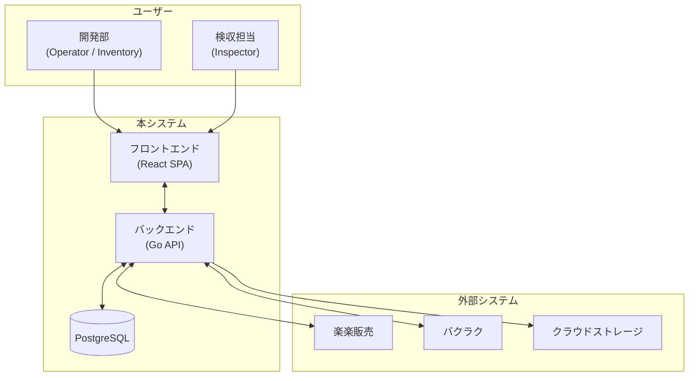
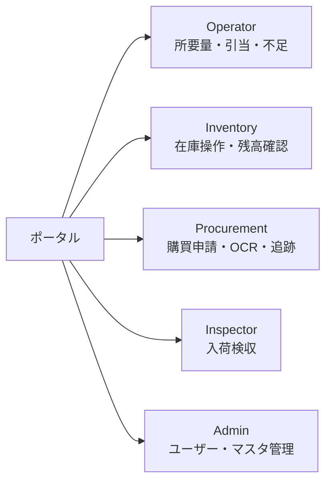
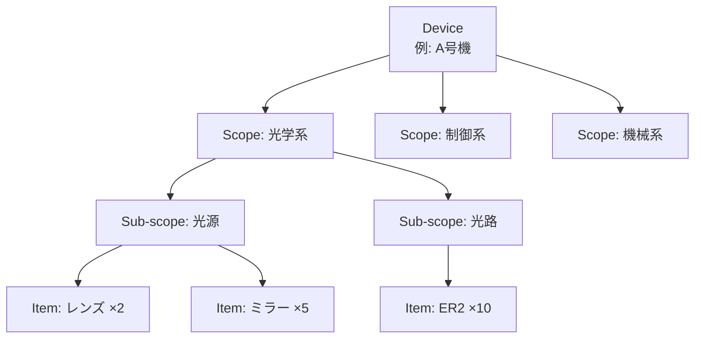
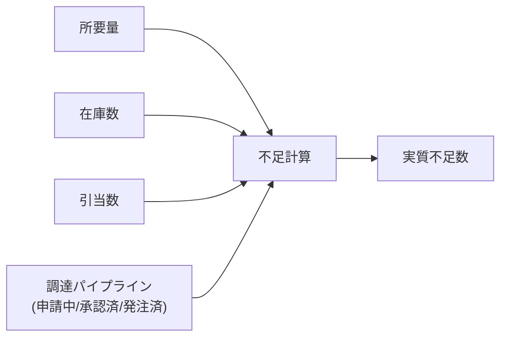
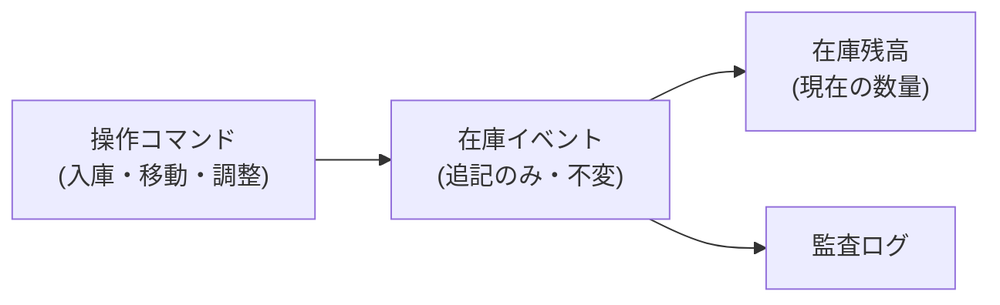
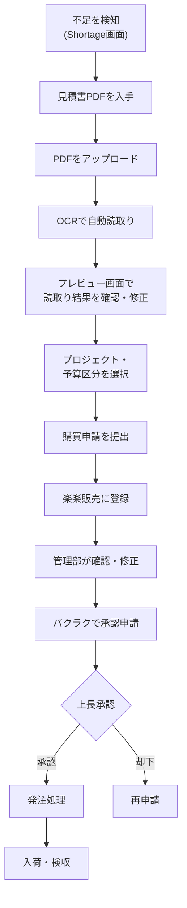
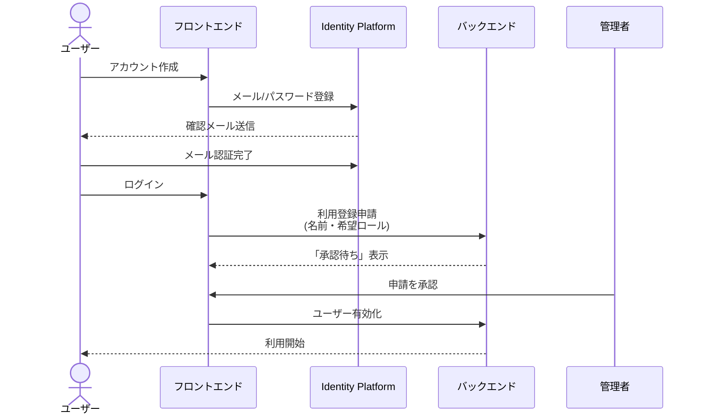
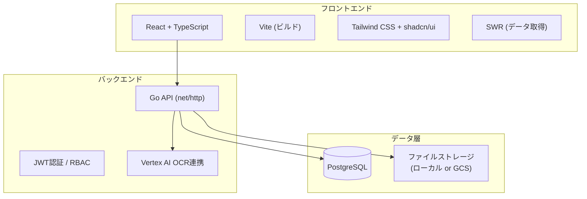
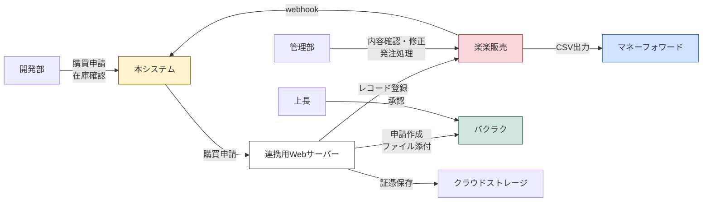

# 在庫管理システム 利用者向けガイド

> **対象読者:** 本システムをこれから使い始める開発部・管理部のメンバー
> **目的:** システムの全体像と各画面の役割を短時間で把握する

---

## 1. このシステムは何をするものか

本システムは**開発装置(Device)に必要な部品・資材の在庫管理と調達追跡**を一元的に行うWebアプリケーションです。

従来は各担当者がスプレッドシートや個別ツールで管理していた以下の情報を、ひとつのシステムに集約します。

- **在庫** — 何がどこに何個あるか
- **所要量** — 各スコープに何が何個必要か
- **引当(予約)** — 誰がどの部品をいつまで確保しているか
- **不足(Shortage)** — 何がどれだけ足りないか
- **調達** — 見積書のOCR取り込みから購買申請・承認・発注・入荷までの追跡

---

## 2. 全体構成 — 30秒で把握する

---

## 3. 5つのアプリ領域

本システムは**5つの領域(アプリセクション)**に分かれており、サイドバーから切り替えられます。ログイン後のポータル画面から、自分のロールに応じたセクションにアクセスできます。

| 領域 | 主な利用者 | できること |
|------|-----------|-----------|
| **Operator** | 開発部 | スコープ単位の所要量管理、引当(予約)、不足分析、CSVインポート/エクスポート |
| **Inventory** | 開発部・倉庫担当 | 在庫残高の確認(品目別・ロケーション別)、入庫・移動・調整、イベント履歴、入荷カレンダー |
| **Procurement** | 開発部・管理部 | 見積書PDF→OCR取り込み、購買申請の作成・提出、外部システムとの同期状況の確認 |
| **Inspector** | 検収担当 | 入荷予定の確認と検収処理 |
| **Admin** | 管理者 | ユーザー承認、ロール管理、マスタデータ(品目・仕入先・エイリアス)の登録 |

---

## 4. 核心概念 — Device / Scope / Item

本システムの操作は常に **Device(装置) → Scope(スコープ) → Item(品目)** の階層で整理されます。

- **Device:** 開発中の装置・製品
- **Scope:** 装置内のサブシステムや作業領域(光学系・制御系・機械系など)。階層構造を持ち、さらに下位のSub-scopeを定義できます
- **Item:** 部品・資材。メーカー・品番・カテゴリなどで管理されるマスタデータ

---

## 5. Operator — 所要量と不足の管理

### 主な画面

**Scope Overview（スコープ一覧）**
スコープのツリー構造を一覧表示し、各スコープの所要量・引当・不足の要約数値を確認できます。ここから各詳細画面へ遷移します。

**Requirements（所要量）**
スコープごとに「何が何個必要か」を登録・確認します。CSVでの一括インポートにも対応しています。

**Reservations（引当・予約）**
在庫から特定スコープ向けに部品を確保します。以下の日時フィールドで引当の期間を管理します。

| フィールド | 意味 |
|-----------|------|
| `needed_by` | いつまでに必要か（緊急度の判断に使用） |
| `planned_use` | いつ使用する予定か |
| `hold_until` | いつまで確保を維持するか |

**Shortage（不足分析）** — 最重要画面のひとつ
所要量から在庫・引当・調達中の数量を差し引いて「本当に足りない数」を算出します。

不足の計算では、調達パイプラインのどの段階まで考慮するか（申請済み/承認済み/発注済みなど）をカバレッジルールとして切り替えられます。不足品はCSVでエクスポートして見積取得に使えます。

---

## 6. Inventory — 在庫の実操作

### 主な画面

**Items（品目別在庫）**
全品目の在庫残高を一覧で確認します。品番・メーカー・カテゴリなどでフィルタリング・検索が可能です。

**Locations（ロケーション別在庫）**
倉庫やラボなどの保管場所ごとの在庫を確認します。

**Events（在庫イベント）**
入庫(receive)・移動(move)・調整(adjust)・消費(consume)などの操作を行い、すべての操作履歴を確認できます。

**Item Flow（品目フロー）**
特定品目の入出庫の時系列変動を確認できます（例: 「2026/05/10: +10 入荷, 2026/05/12: -20 引当消費」）。

**Arrival Calendar（入荷カレンダー）**
注文の入荷予定をカレンダー形式で確認できます。どの注文書に紐づいた入荷かも確認可能です。

### 在庫データの仕組み

在庫変更はすべて「イベント」として記録され、過去のイベントは変更・削除されません。間違った操作は「取消イベント（Undo）」として新しいイベントが生成されます。

---

## 7. Procurement — 購買申請と調達追跡

### 調達の流れ

### 主な画面

**OCR Queue（OCRキュー）**
見積書PDFをアップロードすると、Vertex AI OCRが品名・数量・単価などを自動で読み取ります。読取り結果はあくまで「下書き」であり、必ず確認・修正してから提出します。

**Requests（購買申請一覧）**
申請の状態（申請中→承認待ち→承認済→発注済→入荷済）を一覧で追跡できます。外部システム（楽楽販売・バクラク）のステータスはWebhookと定期同期で自動反映されます。

---

## 8. Inspector — 入荷検収

入荷予定の確認と、届いた部品の検収処理を行う画面です。検収を確定すると在庫に自動反映されます。

---

## 9. Admin — システム管理

**Users（ユーザー管理）**
新規ユーザーの登録申請の承認・却下を行います。本システムはメールアドレスによる認証（Identity Platform）を使用しており、初回アクセス時にアカウント作成→メール認証→管理者承認の流れを経て利用開始となります。

**Roles（ロール管理）**
ロールごとの権限を管理します。

| ロール | 説明 |
|-------|------|
| `admin` | 全機能へのアクセス、ユーザー承認 |
| `operator` | 所要量・引当・不足の管理 |
| `inventory` | 在庫操作と閲覧 |
| `procurement` | 購買申請の作成と追跡 |
| `receiving_inspector` | 入荷検収 |

**Master Data（マスタデータ管理）**
品目(Items)、メーカー(Manufacturers)、仕入先(Suppliers)、仕入先エイリアス(Supplier Aliases)、カテゴリエイリアスなどのマスタデータを管理します。CSVでの一括登録にも対応しています。

---

## 10. 認証とアクセスの流れ

---

## 11. システム構成（技術的な参考情報）

| 項目 | 技術 |
|------|------|
| フロントエンド | React, TypeScript, Vite, Tailwind CSS, SWR |
| バックエンド | Go 1.24+, net/http |
| データベース | PostgreSQL |
| 認証 | Firebase Identity Platform (JWT/OIDC) |
| OCR | Google Vertex AI |
| デプロイ先 | Google Cloud Run |
| 外部連携 | 楽楽販売, バクラク |

---

## 12. 外部システムとの連携全体像

---

## 付録: よくある操作フロー

### 「スコープの不足を確認して調達を開始する」

1. **Operator > Scope Overview** でデバイスとスコープを選択
2. **Shortage** 画面で不足品目と実質不足数を確認
3. 不足品をCSVエクスポートし、仕入先から見積書PDFを入手
4. **Procurement > OCR Queue** で見積書PDFをアップロード
5. OCR結果を確認・修正し、プロジェクト・予算区分を選択して提出
6. 以降の承認・発注は楽楽販売/バクラクで処理され、結果が自動同期される

### 「部品を入庫して在庫に反映する」

1. **Inspector > Arrivals** で入荷予定を確認
2. 届いた部品の検収を実施
3. 検収確定で在庫残高に自動反映

### 「在庫を別のロケーションに移動する」

1. **Inventory > Events** から「Move」操作を選択
2. 品目・移動元・移動先・数量を入力して実行
3. 在庫残高が即座に更新される
